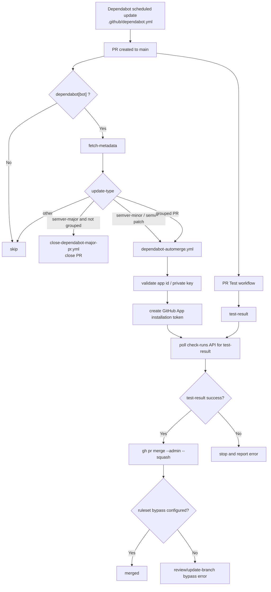

# CI を通した健全な Dependabot の自動マージと自動クローズの構築方法

このドキュメントは、`Dependabot` の更新 PR を安全に自動処理するための構成をまとめたものです。
対象ファイルは次の 3 つです。

- `.github/dependabot.yml`
- `.github/workflows/close-dependabot-major-pr.yml`
- `.github/workflows/dependabot-automerge.yml`

この構成では、`major` 更新を自動で閉じ、`minor` / `patch` 更新だけを条件付きで自動マージします。
ただし「何でも自動で通す」のではなく、`main` の保護ルールを前提にしつつ、`Dependabot` に必要な経路だけを GitHub App で安全に通す設計にしています。

検証したリポジトリは以下に載せておきますので、参考にしてください。
下にある設計意図のコード例は、こちらにはないものもあるので注意してください。

[https://github.com/lvncer/dependabot-bypass-test](https://github.com/lvncer/dependabot-bypass-test)

## アジェンダ

| no  | タイトル                                            | 説明                                                  |
| --- | --------------------------------------------------- | ----------------------------------------------------- |
| 1   | [導入するメリット](#1-導入するメリット)             |                                                       |
| 2   | [前提条件](#2-前提条件)                             | リポジトリの `branch protection / ruleset` の設定など |
| 3   | [全体の構成](#3-全体の構成)                         | Github Actions によるワークフローの図解               |
| 4   | [セットアップ方法](#4-セットアップ方法)             |                                                       |
| 5   | [コードで細かめに解説](#5-コードで細かめに解説)     | 重要な処理の該当コードの設計意図と解説                |
| 6   | [エラーに苦戦したところ](#6-エラーに苦戦したところ) |                                                       |

## 1. 導入するメリット

### レビューコストを下げられる

依存関係の `patch` / `minor` 更新は数が多いわりに、毎回 2 人以上の承認を取って手動マージするのは運用負荷が高くなります。
この仕組みを入れると、低リスク更新は CI 成功後に自動で処理できるため、開発者は機能開発や高リスク変更のレビューに集中できます。

### `major` 更新だけを確実に人手に寄せられる

`major` 更新は破壊的変更を含む可能性が高いため、自動マージ対象から除外したいことが多いです。
本構成では `major` PR を自動で閉じるため、レビュー待ちキューに低優先度の大型変更が溜まりにくくなります。

### branch protection を崩さずに運用できる

単純に `GITHUB_TOKEN` でマージしようとすると、`Require approvals` や `Require branches to be up to date` を突破できません。
この構成では GitHub App を bypass actor に追加し、突破させる条件を限定したうえで、required check はワークフロー側で明示的に確認しています。

### Dependabot の PR 数を抑えやすい

`dependabot.yml` の `groups` を使って `development` 依存や `production` 依存をまとめられるため、細かい PR が大量に出続ける状態を避けられます。

## 2. 前提条件

この運用は、GitHub の branch protection / ruleset を前提にしています。
特に重要なのは「何を bypass し、何を bypass しないか」を明確に分けることです。

このリポジトリでは `main` に対して、少なくとも次のような制約を置く前提です。

- Pull Request 必須
- `Required approvals` 2 人以上
- `Required status checks to pass` 必須
- branch を最新に保つことを必須化

一方で、Dependabot の `patch` / `minor` 更新まで毎回 2 人承認を求めると、運用コストが高くなります。
そのため、GitHub App を `main` を保護している ruleset の bypass actor に追加し、次の条件だけを突破できるようにします。

- `required pull requests` に含まれる承認要件
- `Require branches to be up to date before merging`

ここで重要なのは、**required checks までは bypass しない** ことです。
この構成では `test-result` が成功したときだけ自動マージに進むため、レビュー要件は緩めつつ、CI は維持できます。

## 3. 全体の構成

以下が全体フローです。



### 分担の考え方

- `dependabot.yml`: どの更新を、どの粒度で PR 化するかを決める
- `close-dependabot-major-pr.yml`: 人手確認が必要な `major` を自動で棚から外す
- `dependabot-automerge.yml`: `minor` / `patch` だけを CI 成功後に自動マージする

この 3 層に分けると、「PR をどう出すか」「どれを自動で捨てるか」「どれを自動で通すか」の責務が分離され、運用しやすくなります。

## 4. セットアップ方法

### 0. 最初に「通すべき CI」を決める

この構成を入れるときは、最初に「Dependabot PR が最終的に何を通過したら merge してよいのか」を決めておく必要があります。
ここが曖昧なまま auto-merge だけ作ると、required check の選び方が後付けになり、ruleset と workflow の責務がずれやすくなります。

各テストジョブの結果を集約する `test-result` を最終 gate にしています。

```yaml
test-result:
  needs:
    [
      detect-changes,
      test-front-smartphone,
      test-control-pc,
      test-back-smartphone,
      validate-infrastructure,
      infra-change-warning,
      format-check,
      semgrep-scan,
    ]
  if: always()
  runs-on: ubuntu-latest
  steps:
    - name: Check test results
      run: |
        if [[ "${{ needs.test-front-smartphone.result }}" == "failure" ]] || \
           [[ "${{ needs.test-back-smartphone.result }}" == "failure" ]] || \
           [[ "${{ needs.test-control-pc.result }}" == "failure" ]] || \
           [[ "${{ needs.validate-infrastructure.result }}" == "failure" ]] || \
           [[ "${{ needs.format-check.result }}" == "failure" ]]; then
          echo "One or more tests failed"
          exit 1
        fi
```

設計意図は、auto-merge workflow 側では多数のジョブ名を直接意識せず、**最終的な required check を 1 つだけ見る** ことです。
このように gate を 1 本に集約しておくと、Dependabot auto-merge 側の判定が単純になり、将来的に個別 CI の構成が変わっても追従しやすくなります。

そのうえで、GitHub の ruleset / branch protection 側でも、この最終 gate を required check に設定します。
本ドキュメントではこの check を `test-result` として説明しますが、プロジェクトによっては `ci`, `build-and-test`, `merge-ready` のような集約ジョブ名でも構いません。

### 1. `dependabot.yml` を作成する

まず、更新対象の package ecosystem と directory を列挙します。
`npm` の各 package では、`development` 依存を `minor` / `patch` でまとめ、`production` 依存は `patch` のみをまとめています。
これにより、日常的な保守更新は PR 数を抑えつつ安全側に寄せられます。

### 2. `major` 更新を閉じる workflow を追加する

`.github/workflows/close-dependabot-major-pr.yml` を追加し、`pull_request_target` の `opened` で起動させます。

処理内容はシンプルです。

1. `dependabot/fetch-metadata` で `update-type` を取得
2. `version-update:semver-major` かつ grouped PR ではない場合だけ PR を閉じる

grouped PR を除外しているのは、まとめ更新では `fetch-metadata` が個別更新と同じ解像度で判定できないことがあるためです。

### 3. auto-merge workflow を追加する

`.github/workflows/dependabot-automerge.yml` を追加し、`pull_request_target` の `opened`, `synchronize`, `reopened`, `ready_for_review` で起動させます。

基本の流れは次のとおりです。

1. Dependabot PR か判定
2. `minor` / `patch` または grouped PR か判定
3. GitHub App token を発行
4. `test-result` が成功するまで待機
5. `gh pr merge --admin --squash` でマージ

### 4. GitHub App を作成し、インストールする

`Settings > Developer settings > GitHub Apps` から `New Github App` を選択してください。

`Identifying and authorizing users` の `Expire user authorization tokens` と `Webhook` の `Active` は OFF にして問題ないです。
`Permission` の `Repository permissions` で次の権限が必要です。

| Resource          | Access           |
| ----------------- | ---------------- |
| `Actions`         | `Read-only`      |
| `Checks`          | `Read-only`      |
| `Commit statuses` | `Read-only`      |
| `Contents`        | `Read and write` |
| `Pull requests`   | `Read and write` |

`gh` CLI の GraphQL は見た目以上に多くの field を読みに行くため、`checks` だけでなく `statuses` や `actions` も必要になることがあります。

`Settings > Developer settings > GitHub Apps` から作成した App を選択し、`Install App` からインストールをしてください。

App をインストールしたら、リポジトリの設定画面から `Secrets and variables` の `Actions` に次を設定します。
`dependabot-automerge.yml` では、次の repository variable / secret を使って installation token を発行します。

- Repository Secrets

  | Name                                   | Secret                              |
  | -------------------------------------- | ----------------------------------- |
  | `DEPENDABOT_AUTOMERGE_APP_PRIVATE_KEY` | <github app で作成した private key> |

- Repository Variables

  | Name                          | Secret             |
  | ----------------------------- | ------------------ |
  | `DEPENDABOT_AUTOMERGE_APP_ID` | <Github App の id> |

### 5. ruleset / branch protection の bypass actor に App を追加する

この設定を忘れると、CI は通っても `gh pr merge --admin` が review 要件や update-branch 要件で止まります。

少なくとも次のルールを GitHub App が bypass できるようにします。

- review required
- branch must be up to date

一方、required checks まで bypass すると安全性が落ちるため、この構成では bypass させません。

### 6. `test-result` を required check に設定する

本構成は `test-result` を最終的な gate としています。
そのため、PR テスト workflow 側で `test-result` が常に最終判定ジョブとして存在すること、そして GitHub 側で required check に設定されていることが前提です。

## 5. コードで細かめに解説

### `.github/dependabot.yml`

このファイルの役割は「更新戦略の設計」です。

#### 更新対象をサービスごとに分けている理由

例えば、各サービスごとに ecosystem を分けて定義しています。

```yaml
updates:
  - package-ecosystem: "npm"
    directory: "/control-pc"
    target-branch: "main"

  - package-ecosystem: "npm"
    directory: "/front-smartphone"
    target-branch: "main"

  - package-ecosystem: "npm"
    directory: "/back-smartphone"
    target-branch: "main"
```

`control-pc`, `front-smartphone`, `back-smartphone` を個別に定義しておくと、どのサービスの依存更新なのかが PR 単位で把握しやすくなります。
monorepo 全体を 1 つの ecosystem として扱うより、影響範囲の見通しがよくなります。

#### `groups` を使っている理由

例えば `front-smartphone` では次のように grouped PR を作っています。

```yaml
- package-ecosystem: "npm"
  directory: "/front-smartphone"
  groups:
    dev-dependencies:
      dependency-type: "development"
      update-types:
        - "minor"
        - "patch"
    production-dependencies:
      dependency-type: "production"
      update-types:
        - "patch"
```

- `dev-dependencies`: `minor` / `patch`
- `production-dependencies`: `patch`

設計意図は、低リスクな更新だけをまとめ、レビューコストを抑えることです。
逆に `production` の `minor` は grouped auto-merge に混ぜていないため、運用上の慎重さを保てます。

#### `github-actions` を分けている理由

GitHub Actions だけは別 ecosystem に切り出しています。

```yaml
- package-ecosystem: "github-actions"
  directory: "/"
  target-branch: "main"
  open-pull-requests-limit: 5
  labels:
    - "dependencies"
    - "github-actions"
```

GitHub Actions の更新はアプリ依存とは性質が違うため、別 ecosystem に切り出しています。
ラベルも `github-actions` を追加して識別しやすくしています。

### `.github/workflows/close-dependabot-major-pr.yml`

この workflow の役割は「不要な `major` PR を入口で止めること」です。

#### `pull_request_target` を使う理由

workflow のトリガーは次の通りです。

```yaml
on:
  pull_request_target:
    types: [opened]
```

Dependabot PR に対して、ベースリポジトリ側の権限で安全に metadata を取りたいからです。
PR ブランチ側のコードを checkout せずに済むため、依存更新 PR に対する制御ワークフローとして相性がよいです。

#### `fetch-metadata` を使う理由

更新種別の判定には `dependabot/fetch-metadata` を使っています。

```yaml
- name: Fetch Dependabot metadata
  id: metadata
  uses: dependabot/fetch-metadata@v2
  with:
    github-token: "${{ secrets.GITHUB_TOKEN }}"
```

PR タイトルをパースして version difference を自前判定するより、Dependabot 公式 action の出力を使うほうが安定します。
`update-type` をそのまま見られるため、ロジックが単純になります。

#### `dependency-group == ''` を見ている理由

実際の条件分岐は次の 1 行です。

```yaml
- name: Close major update PR
  if: steps.metadata.outputs.update-type == 'version-update:semver-major' && steps.metadata.outputs.dependency-group == ''
  uses: actions/github-script@v7
  with:
    script: |
      const { owner, repo } = context.repo;
      const pull_number = context.payload.pull_request.number;

      await github.rest.pulls.update({
        owner,
        repo,
        pull_number,
        state: 'closed'
      });
```

grouped PR は `fetch-metadata` の出力が単一依存更新と同じ精度で扱えないことがあります。
そのため、この workflow では「単独の `major` 更新だけを閉じる」方針に寄せています。

### `.github/workflows/dependabot-automerge.yml`

この workflow が中核です。
役割は「自動マージしてよい PR を見極め、必要な条件を満たしたら GitHub App でマージすること」です。

#### `Evaluate PR eligibility`

ここでは次の条件を見ています。

該当コードは次の部分です。

```yaml
- name: Evaluate PR eligibility
  id: evaluate
  uses: actions/github-script@v7
  env:
    UPDATE_TYPE: ${{ steps.metadata.outputs.update-type }}
    DEPENDENCY_GROUP: ${{ steps.metadata.outputs.dependency-group }}
  with:
    script: |
      if (pr.state !== 'open') {
        core.setOutput('eligible', 'false');
        return;
      }

      if (pr.draft) {
        core.setOutput('eligible', 'false');
        return;
      }

      const allowedBaseBranches = ['main'];
      if (!allowedBaseBranches.includes(pr.base.ref)) {
        core.setOutput('eligible', 'false');
        return;
      }

      if (pr.user?.login !== 'dependabot[bot]') {
        core.setOutput('eligible', 'false');
        return;
      }
```

- PR が open である
- draft ではない
- base branch が `main`
- PR 作成者が `dependabot[bot]`
- `minor` / `patch` 更新、または grouped PR

設計意図は、「マージ条件に関係ない失敗」を早い段階で落とし、後続ステップをシンプルに保つことです。

#### grouped PR を許可している理由

grouped PR を許可する分岐はここです。

```sh
const eligibleUpdateTypes = [
  'version-update:semver-patch',
  'version-update:semver-minor'
];

if (eligibleUpdateTypes.includes(updateType)) {
  core.setOutput('eligible', 'true');
  core.setOutput('pr_number', String(pr.number));
  return;
}

// Grouped PRs: fetch-metadata may not resolve update-type.
// Our dependabot.yml groups only include minor/patch, so
// any grouped PR from dependabot is safe to automerge.
if (dependencyGroup) {
  core.setOutput('eligible', 'true');
  core.setOutput('reason', `Eligible (grouped: ${dependencyGroup})`);
  core.setOutput('pr_number', String(pr.number));
  return;
}
```

`dependabot.yml` 側で npm package の groups には `minor` / `patch` しか含めていません。
そのため grouped PR は「この repo の運用ルール上、安全側に倒した集合」とみなせます。

この前提があるので、workflow 側では grouped PR を auto-merge 対象として扱えます。

#### GitHub App token を毎回発行する理由

token 発行部分は次の通りです。

```yaml
- name: Create GitHub App token
  id: app-token
  if: steps.evaluate.outputs.eligible == 'true'
  uses: actions/create-github-app-token@v3
  with:
    app-id: ${{ vars.DEPENDABOT_AUTOMERGE_APP_ID }}
    private-key: ${{ secrets.DEPENDABOT_AUTOMERGE_APP_PRIVATE_KEY }}
    owner: ${{ github.repository_owner }}
    repositories: ${{ github.event.repository.name }}
```

長期トークンを secret に固定すると、権限管理や失効管理が重くなります。
GitHub App から installation token を毎回発行すれば、必要な権限をその都度借りる形にできます。

#### `test-result` を直接待つ理由

過去には `gh pr checks --required --watch` を使っていましたが、現在は PR の head SHA に対して `check-runs` API を直接ポーリングしています。

現在の待機ロジックは次の通りです。

```yaml
- name: Wait for required checks
  if: steps.evaluate.outputs.eligible == 'true'
  env:
    GH_TOKEN: ${{ steps.app-token.outputs.token }}
    PR_NUMBER: ${{ steps.evaluate.outputs.pr_number }}
    REPOSITORY: ${{ github.repository }}
    REQUIRED_CHECK_NAME: test-result
  run: |
    PR_HEAD_SHA=$(gh api "repos/$REPOSITORY/pulls/$PR_NUMBER" --jq '.head.sha')

    for attempt in $(seq 1 "$MAX_ATTEMPTS"); do
      checks_json=$(gh api -H "Accept: application/vnd.github+json" \
        "repos/$REPOSITORY/commits/$PR_HEAD_SHA/check-runs?per_page=100")

      matching_count=$(printf '%s' "$checks_json" | jq --arg name "$REQUIRED_CHECK_NAME" \
        '[.check_runs[] | select(.name == $name)] | length')
```

設計意図は 2 つあります。

1. required check の登録直後の race condition を避ける
2. `gh` CLI の GraphQL 実装に依存しすぎないようにする

この方式では、`test-result` がまだ作られていないときは「未登録」として待機し、作られた後は `status` / `conclusion` だけを見ればよいので、判定が安定します。

判定部分もシンプルです。

```sh
if [ "$matching_count" -eq 0 ]; then
  echo "[$attempt/$MAX_ATTEMPTS] Check '$REQUIRED_CHECK_NAME' is not registered yet."
else
  check_status=$(printf '%s' "$checks_json" | jq -r --arg name "$REQUIRED_CHECK_NAME" \
    '[.check_runs[] | select(.name == $name)] | sort_by(.id) | last | .status')
  check_conclusion=$(printf '%s' "$checks_json" | jq -r --arg name "$REQUIRED_CHECK_NAME" \
    '[.check_runs[] | select(.name == $name)] | sort_by(.id) | last | .conclusion // "null"')

  if [ "$check_status" = "completed" ]; then
    if [ "$check_conclusion" = "success" ]; then
      exit 0
    fi
    exit 1
  fi
fi
```

#### `gh pr merge --admin --squash` を使う理由

マージ実行箇所は次です。

```yaml
- name: Merge Dependabot PR with gh (admin squash)
  if: steps.evaluate.outputs.eligible == 'true'
  env:
    GH_TOKEN: ${{ steps.app-token.outputs.token }}
    PR_NUMBER: ${{ steps.evaluate.outputs.pr_number }}
    REPOSITORY: ${{ github.repository }}
  run: |
    output=$(gh pr merge "$PR_NUMBER" --admin --squash --repo "$REPOSITORY" 2>&1)
```

この構成の目的は「review / update-branch 要件だけを GitHub App で突破し、required checks は守る」ことです。
`--admin` を付けることで bypass actor としての権限を使い、`--squash` によって履歴も過度に散らばらないようにしています。

#### エラーメッセージを細かく分けている理由

エラー分類は次のように出し分けています。

```sh
if [[ "$normalized" == *"required status check"* ]] || [[ "$normalized" == *"required checks"* ]]; then
  echo "::error title=Required checks are not satisfied::This workflow only bypasses review and update-branch requirements. Required checks must pass before the admin merge runs."
  exit "$exit_code"
fi

if [[ "$normalized" == *"approving reviews are required"* ]]; then
  echo "::error title=GitHub App bypass is not configured::The GitHub App behind this installation token is still blocked by review requirements. Add the App to the bypass list for the main ruleset."
  exit "$exit_code"
fi

if [[ "$normalized" == *"out-of-date with the base branch"* ]]; then
  echo "::error title=GitHub App update-branch bypass is not configured::The GitHub App behind this installation token is still blocked by the up-to-date requirement. Add the App to the bypass list for the main ruleset."
  exit "$exit_code"
fi
```

マージ失敗時に次のようなケースを明示的に切り分けています。

- required checks 未達
- review bypass 未設定
- update-branch bypass 未設定
- App 権限不足

Dependabot の自動化は GitHub 側設定の影響が大きいため、「コードが悪いのか、設定が足りないのか」をログから判別できることが運用上かなり重要です。

### GitHub App を使う理由

`GITHUB_TOKEN` は branch protection / ruleset の bypass actor になれません。
そのため、承認要件や update-branch 要件を限定的に突破したい場合は、専用の GitHub App を使う必要があります。

専用の Bot の GitHub ユーザー作るという方法もあったのですが、Github の思想的に以下の理由からこちらを採用しました。

- 権限が細かく制御できる
- セキュリティ的に安全（PATより良い）
- org単位で管理しやすい

## 6. エラーに苦戦したところ

今回の構成で一番苦戦しやすいのは、**ワークフローのロジックより GitHub 側の権限モデルと API の癖** です。

### 1. `Resource not accessible by integration`

最初にぶつかりやすいのがこれです。

例えば次のようなエラーが出ます。

- `node.statusCheckRollup.nodes.0.commit.statusCheckRollup`
- `...checkSuite.workflowRun`

これは単純に `pull-requests: write` や `contents: write` だけでは足りず、`gh` CLI が内部で GraphQL の追加 field を読みに行っていたことが原因でした。

特にハマりやすかったのは次です。

- `Checks: Read` が必要
- `Commit statuses: Read` が必要
- `Actions: Read` が必要

「PR を読むだけなら `pull-requests` だけで十分そう」に見えても、実際には `gh` が `statusCheckRollup` や `workflowRun` を読みに行くため、関連権限を広めに見ておく必要がありました。

### 2. `no required checks reported`

権限を通したあとに次に出たのがこれです。

これは required check が失敗しているのではなく、**PR 作成直後で `test-result` がまだ登録されていないタイミングに auto-merge workflow が先に走ってしまう** のが原因でした。

つまり、問題は CI 結果ではなく race condition でした。

この問題に対して、`gh pr checks --required --watch` をやめ、`check-runs` API を直接叩いて `test-result` の出現を待つ方式に切り替えています。

### 3. bypass 設定不足によるマージ失敗

CI が通っていても、次のような設定不足でマージに失敗することがあります。

- review bypass が未設定
- update-branch bypass が未設定

このケースでは workflow の実装を疑いたくなりますが、実際には GitHub App を ruleset の bypass actor に追加していないのが原因です。
コード側でログを分岐させておくと、設定漏れに気付きやすくなります。

### 4. `GITHUB_TOKEN` では解決しない問題がある

GitHub Actions ではまず `GITHUB_TOKEN` を使いたくなりますが、この問題は token の権限を workflow 側で増やすだけでは解決しません。
承認要件や update-branch 要件の bypass は GitHub App 側の責務だからです。

そのため、今回のような構成では「workflow permissions を増やす」「GitHub App permissions を増やす」「ruleset bypass actor を設定する」を別々に考える必要がありました。

## まとめ

この構成のポイントは、Dependabot を全面的に信頼することではなく、**低リスク更新だけを運用ルールの中で安全に自動化すること** です。

整理すると、次の方針です。

- `major` は自動で閉じる
- `minor` / `patch` だけを auto-merge 対象にする
- review / update-branch は GitHub App で限定的に bypass する
- required check の `test-result` は必ず成功させる
- 判定は GitHub CLI の挙動に寄せすぎず、必要なところは API を直接見る

この形にしておくと、保護ルールを維持したまま、依存更新の運用負荷だけをかなり下げられます。
