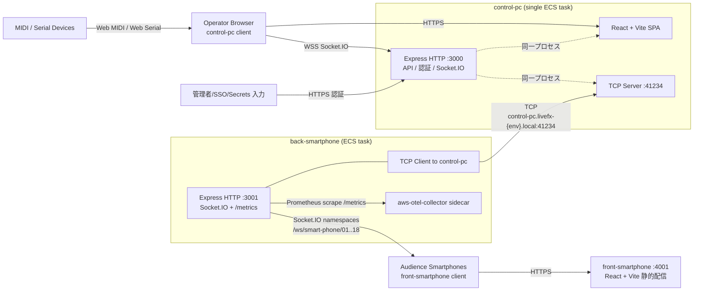
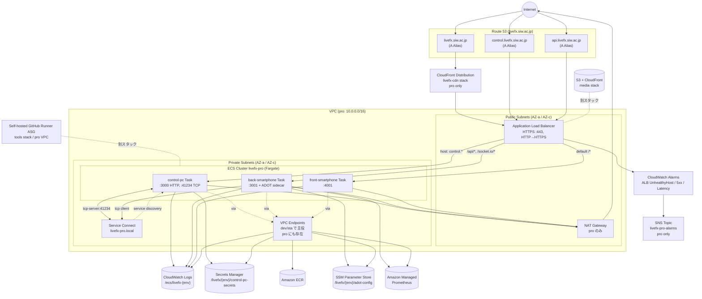
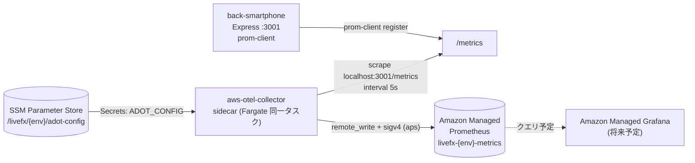
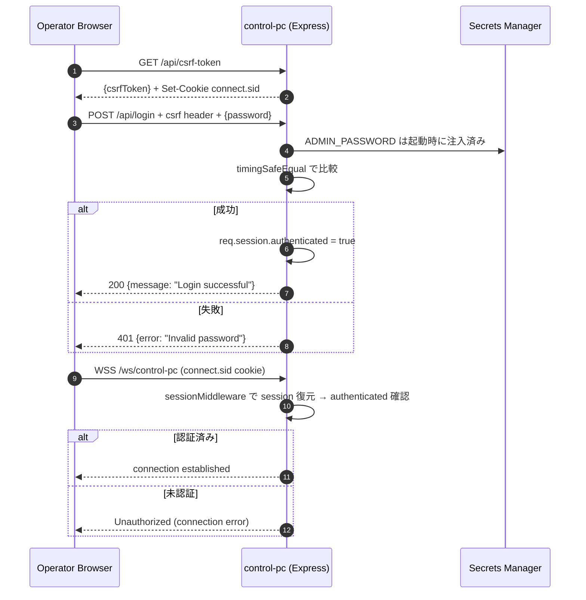

# WebSocket 同時接続 3000 超のライブ演出システムを 2026 年も披露しました

## アジェンダ

| no  | タイトル                                                                | 説明                                     |
| --- | ----------------------------------------------------------------------- | ---------------------------------------- |
| 1   | [はじめに](#1-はじめに)                                                 | 大成功の裏側                             |
| 2   | [去年からの進化](#2-去年からの進化)                                     | 去年からのアップデート                   |
| 3   | [プロジェクトについて](#3-プロジェクトについて)                         | 開発メンバーのアップデートなど           |
| 4   | [システムアーキテクチャ（2026ver）](#4-システムアーキテクチャ2026ver)   | 2026年版アーキテクチャ構成               |
| 5   | [改めてプレゼン構成とシステム紹介](#5-改めてプレゼン構成とシステム紹介) | プレゼン構成とシステムの使い方           |
| 6   | [スケジュール感](#6-スケジュール感)                                     | 開発の経過を解説                         |
| 7   | [失敗・学び](#7-失敗学び)                                               | 本プロジェクトでの失敗とそこから得た学び |
| 8   | [感想](#8-感想)                                                         | プロジェクト中に起きたトラブル           |
| 9   | [今後2027への布石](#9-今後2027への布石)                                 | 商用化を含めた今後の展望                 |

## 1. はじめに

結論から言うと、今回も大成功しました。

改めて、LiveFx は、ライブパフォーマンスにおける演者と観客間のインタラクションを促進するために開発されたデジタル演出ツールです。
本システムの主要な特徴は、演者側の MIDI コントローラーによる画面演出の操作を、リアルタイムに観客のスマートフォンへ視覚効果として同期表示させる点にあります。

滋慶学園グループの入学式プレゼンでの利用を目的として開発されました。
また、保護者を含めた 18 の専門学校グループ、最大 5,000 台の観客用スマートフォンへの同時配信を想定したスケーラブルな設計が求められました。

本稿では、この学生主体となった貴重な開発経験を振り返り、その経緯や所感を共有することを目的とします。
また、記録してきた写真やソースコードの一部を、公開可能な範囲で提示します。
近いうちに、ソースコードを OSS として公開できるようにしたいと思っています。


## 2. 去年からの進化

去年のzenn記事に関してはこちらにあります。

[https://zenn.dev/siw/articles/2e73439f678488](https://zenn.dev/siw/articles/2e73439f678488)

今回の記事では「今年は何が違うのか」に注目してまとめました。

### 環境整備

- Gitlab → Github 移行
- EKS（Elastic Kubernetes Service）→ ECS（Elastic Container Service）移行
- タグ駆動ブランチングによって dev, sta, pro 環境へのデプロイ
- Artillery を使用した WebSocket 接続テストと、HTTP エンドポイントへの負荷テスト導入
- githookを使った Biome フォーマットを強制
- Dependabot追加と CI 通過で PR の自動マージと自動クローズ
- Discord botによる議事録作成

### リファクタ

- コントロールのサーバー統合（ `front-control-pc` と `back-control-pc` を `control-pc` へ統合）
- コントロールパネルの大幅刷新
- 全体的な重複コードやバグ修正

### 新機能

- NTP (Network Time Protocol) を利用して、端末間の時刻ずれを吸収
- インタラクティブな演出を追加（クライアントから桜を咲かせる演出）
- SNS 投稿機能（会場の様子を SNS に共有）

### ドキュメント

- notionのタスクを追加（コーディング以外の TODO を Github Issue と使い分け運用）

### LiveFx-Site

- 一般向けに案内サイトを追加

  [https://livefx.siw.ac.jp/](https://livefx.siw.ac.jp/)

### AI

- Github Copilot を使った PR レビュー
- 個人では Cursor や Claude Code などで開発

## 3. プロジェクトについて

今回も同じくアジャイル開発を採用しました。

### 開発期間

113 日（約 4 ヶ月）

### 開発メンバーの変化

| 期生                | 年制      | 人数         |
| ------------------- | --------- | ------------ |
| プロジェクト 1 期生 | 新 4 年生 | 8 人 → 5 人  |
| プロジェクト 2 期生 | 新 4 年生 | 0 人 → 3 人  |
| プロジェクト 2 期生 | 新 3 年生 | 0 人 → 4 人  |
|                     |           |              |
| 合計                |           | 8 人 → 12 人 |

- プレゼンターには新しく情報科から 2 人参加

### 役割（Discord のタグで管理、重複あり）

| 役割             | 人数            |
| ---------------- | --------------- |
| PM　             | 2人（筆者含む） |
| デザイナー       | 2人             |
| フロントエンド　 | 7人（筆者含む） |
| バックエンド     | 4人             |
| インフラ         | 3人             |

### 定例会議やコミュニケーションツール

| 会議名   | 頻度 | 内容                   |
| -------- | ---- | ---------------------- |
| 定例会議 | 週一 | 開発に関する会議       |
| 演出会議 | 適宜 | 台本や演出に関する会議 |

| ツール名   | 用途                                                   |
| ---------- | ------------------------------------------------------ |
| GitHub     | レポジトリ/タスク管理                                  |
| Notion     | コーディング以外のタスクや議事録などのドキュメント全て |
| Figma      | 画面設計のデザインやプロトタイプ作成                   |
| FigJam     | スクライビング（途中過程）用                           |
| Discord    | コミュニケーション全般                                 |
| Teams      | 教務とのやりとりに使用                                 |
| Sharepoint | 重要なドキュメントを共有するため                       |

## 4. システムアーキテクチャ（2026ver）

### システム構成図



### AWS 構成図



### サーバーごとの機能

3 アプリの大まかな立ち位置は、`control-pc` が「演出の司令塔」、`back-smartphone` が「スマホ向け配信ハブ」、`front-smartphone` が「観客の描画端末」です。
どれも Node.js / React / TypeScript を使っていますが、責務とプロトコルが明確に分かれています。

#### `front-smartphone`

観客スマホの React アプリ (`front-smartphone`) は、1 つの URL 上で 6 つの画面を切り替えるシングルページ構成です。
オペレーターが `control-pc` から `changePage` イベントを投げると、`back-smartphone` の Socket.IO 経由で `changePage` が届き、`setCurrentPage(page)` で差し替わります。

##### 画面一覧

| 画面                 | MIDI ボタン番号 | 表示タイミング                  | コンポーネント           | 役割 / 中身                                                                                                                                                                                               | 去年からの変化 |
| -------------------- | --------------- | ------------------------------- | ------------------------ | --------------------------------------------------------------------------------------------------------------------------------------------------------------------------------------------------------- | -------------- |
| ロゴ画面             | `112`           | 初回アクセス直後                | `LogoScreen.tsx`         | 黒背景に `LiveFx` ロゴをフェードインで表示。                                                                                                                                                              |                |
| 待機画面             | `113`           | 開式前の案内時間から演出前まで  | `StandbyScreen.tsx`      | グループ番号 (01-18) に紐付く学校名を表示しつつ、`CherryBlossom` で花びらが降る演出。入学おめでとうメッセージ付き                                                                                         |                |
| 演出画面             | `114`           | 本番の演出                      | (何もレンダリングしない) | 画面自体は `null` を返し、`document.body` の背景色と `<div>` フィルターだけで演出する。`changeColor` / `changeFilter` / `pattern` / `sendAdjustmentData` / `sendFlexPatternData` はここでしか反映されない |                |
| インタラクティブ画面 | `115`           | 観客参加型コンテンツ (桜の選択) | `InteractiveScreen.tsx`  | 4 色 (pink/orange/yellow/green) の花から 1 つを選び、上スワイプで確定して `POST /api/cherry-blossom/select` に送る。送信後は「スクリーンをご覧ください！」のロック画面に切り替わる                        | 完全新規追加   |
| エピローグ画面       | `116`           | 演出終了後                      | `EpilogueScreen.tsx`     | `ENDROLL_VIDEO_URL` を `<video autoPlay muted playsInline>` で再生。開発時はローカル MP4、本番は CloudFront 配信                                                                                          | 動画再生に変更 |
| ポータル画面         | `117`           | プレゼン終了後                  | `PortalScreen.tsx`       | イラスト背景に雲のフロートアニメーションを重ね、`PORTAL_SCREEN_LINK_URL` (`https://livefx.siw.ac.jp/`) への導線を作る画面                                                                                 | 完全新規追加   |

#### `control-pc`

サーバー側は受け取ったイベントで `currentPage` / `currentPattern` / `currentFilter` / `currentGroups` を記憶し、同じ内容を TCP で `back-smartphone` へフォワードする

| 状態                   | 更新契機                                                        | 用途                                                      |
| ---------------------- | --------------------------------------------------------------- | --------------------------------------------------------- |
| `currentPage`          | `changePage` イベント受信時                                     | 次の接続/再接続クライアントに送る画面情報                 |
| `currentPattern`       | `pattern` / `sendAdjustmentData` / `sendFlexPatternData` 受信時 | 再接続時に演出を復元するためのペイロード (文字列 or JSON) |
| `currentRunUNIXTimeMs` | パターン系イベント受信時                                        | 演出実行の時間基準 (再接続時の相対時刻計算に使う)         |
| `currentFilter`        | `changeFilter` 受信時                                           | フィルターの不透明度 (0-100)                              |
| `currentGroups`        | 演出イベントの `groups` を直接反映                              | 対象グループの一覧 (1-based)                              |

### 3 アプリの責務マトリクス

| 項目               | control-pc                         | back-smartphone                 | front-smartphone                |
| ------------------ | ---------------------------------- | ------------------------------- | ------------------------------- |
| エントリーポイント | `control-pc/src/server/main.ts`    | `back-smartphone/src/app.ts`    | `front-smartphone/src/main.tsx` |
| 公開ポート         | HTTP 3000 + TCP 41234              | HTTP 3001                       | HTTP 4001 (静的)                |
| Socket.IO 役割     | サーバー (`/ws/control-pc`)        | サーバー (`/ws/smart-phone/NN`) | クライアント                    |
| TCP 役割           | サーバー                           | クライアント                    | なし                            |
| 状態保持           | プロセス内変数 (`currentPage` 他)  | プロセス内変数 + Redis Pub/Sub  | なし (受信即描画)               |
| 認証               | セッション + CSRF                  | なし (CORS allow list)          | なし                            |
| 外部ハードウェア   | ブラウザから Web MIDI / Web Serial | なし                            | なし                            |
| 監視               | `/api/status`                      | `/metrics` (Prometheus)         | ALB アクセスログ中心            |

### メトリクス収集



## 5. 改めてプレゼン構成とシステム紹介

さいたまIT・WEB専門学校のプレゼン構成はざっくり下の通りです。

### イントロ（全体ざっくり）

- 新入生へのお祝い＆自己紹介（エンジニア志望・Web デザイナー志望）
- IT は身近で、生活や様々な分野で活用されていることを説明
- 学校では技術＋コミュニケーション力を学び、IT 人材を育成していると紹介
- 学習成果として「 LiveFx 」を体験してもらう流れへ

### LiveFx パート

- 席ごとに配置された QR コードを読み込んでスマホ準備
- スマホを使って会場演出（単色・ウェーブなど）を体験
- PC から制御されている仕組みを紹介
- インタラクティブ機能で「想い」を花として表現（参加型演出）

### 締め

- LiveFx は今後の発表（美容分野）でも使用
- IT は無限の可能性があり、原動力は一人ひとりの想い
- 学校生活を通して未来を一緒に作ろうと呼びかけ
- 改めて入学おめでとうで締め

また、美容分野でもモデルの動きに合わせた演出が使われました。

## 6. スケジュール感

### 初顔合わせ（2025/12/17）

対面による顔合わせです。
今年の開発方針が決まりました


ここで、大まかなマイルストーンや役割整理をしました。


去年のメンバーをメインに、去年やり残したことと、今年やりたいことをまとめました。
下はそれの要約です

```md
## 今年の追加事項

- **画面/導線**
  - トップにプロジェクト一覧（公開/限定/非公開）
  - 概要・体験方法・環境を明示
  - 認証フローと管理画面（ユーザー/プロジェクト/環境）

- **認証/権限**
  - Cognito検討＋将来移行できる設計
  - Passkey対応検討
  - RBAC（管理者/制作者/一般）

- **リアルタイム/セキュリティ**
  - WebSocketの再接続・モバイル耐性
  - XSS対策、データ検証、トークン管理

- **時刻同期**
  - NTP or WebSocketベースで高精度同期
  - RTT補正・誤差測定
  - 超音波なども含めて検討

- **環境/運用**
  - dev/sta/prod分離
  - staは自動削除でコスト最適化
  - CI/CD＋Discord通知

- **Analytics/監視**
  - 行動ログ・画面遷移取得
  - 接続状況・同期誤差・エラー監視

- **演出/インタラクション**
  - ジェスチャー・マルチタッチ活用
  - 音響（超音波等）による制御
  - フィジカル×デジタル演出重視
```

### 荒れ果てた環境の整備期（2025/12/23〜）

最優先でやるべきは環境構築整備でした。
特に以下の項目です。

#### 1. フォーマッターの導入とCIによる強制

もともとフォーマッターを入れていなかったので、ソースコードはかなり自由に書けていました。
そのせいで空行や構文の書き方の不統一が目立ち、コードリーディングに時間がかかってしまっていました。
私はもともと自分のプロジェクトで `husky` や `lint-staged` を使ってコミット前にフォーマットを強制したことがあったので、比較的簡単に進められました。
また、Github Actions によって、フォーマットされているかのチェックもしてくれました。
devcontainerでやる方法もあったのですが、今回は採用しませんでした。

[https://zenn.dev/risu729/articles/latest-husky-lint-staged](https://zenn.dev/risu729/articles/latest-husky-lint-staged)

#### 2. 通知機能

通知するタイミングは、「演出が始まるタイミング」です。
このタイミングで通知すれば、観客にスマホを掲げるように案内する必要がなくなります。

しかし、結果的にはこれは実装しませんでした。
技術的に難しいんです。
前はPWAを導入するとか、いっそのことスマホアプリにすることも検討しました。
しかし、今回はそこまで必須でないのと、負担が非常に大きいので見送りになりました。

#### 3. コントロールPCの認証機能

去年まで実はコントロールPCには認証基盤がありませんでした。
URLを知っていれば誰でもアクセスできたんです。
つまり、誰でも会場のスマホの演出などの画面を切り替えられました。
純粋に考えればやばいことです。
セキュリティ以前の問題です。
なんでやらなかったか？
「さすがに当日そのURLを知る人はいないだろう」という勝手な想像をしたからです。
QRコードが入った封筒を開くという、サービスを周知させる、という段階を踏んで、コントロールPCから指示を送るまでは１０秒程度。
つまりその時間に特定することはまあ無理だろうと。
結果的には大丈夫だったんで良かったです。

今年からは流石に時間にも余裕があるので追加することにしました。



#### 4. `front-control-pc` と `back-control-pc` を `control-pc` へ統合

なんでこの話が出たのかというと、もともとこのプロジェクトはサーバー数が４つあって多いよねってところからです。
control-pc に関しては分離していたんですが、websocket の接続も１つしかないので、分離する必要はないんですよね。
ただ、フロント UI と API は必要なので、フロントエンドとバックエンドを両方使えるフルスタックフレームワークが必要でした。
今回は使っていた `vite` と `express` を生かして `vite-express` というやつを使いました。

[https://github.com/szymmis/vite-express](https://github.com/szymmis/vite-express)

### 新メンバーの構成理解期（2026/01/06〜）

新メンバーに向けて、ワーキングアグリーメントや、Discordでのチャンネルごとのの使い方、ブランチ運用規則などを `CONTRIBUTING` にまとめて説明しました。

```md
- PR出した人が指定
- レビュワーは関係しそうな人全員指定する
- 2人以上（今年からの人と去年からやってる人）から承認を得たらマージ
- バイパスユーザ（設定する人： ） done
  - PM（）
  - @
  - ...
```

もちろん、プロジェクトのサーバー構成や細かな技術スタックの説明をしました。
まずは自分たちで理解を落とし込んでもらうようにしました。

```md
- [x] 現状のメンバーそれぞれの理解度
      1/27(火)くらいまでに
  - フロント
    - ReactRouter
    - TailwindCSS
    - Reactの基本的文法（`app.tsx`からコンポーネントを追う）
  - バック
    - Typescript(コードを読めるくらいには)
    - socket.io
      →ある程度何をしてるかわかるくらいには読んで
  - インフラ
    - どこが何をやってるか理解しといて

- [x] タスク振り（今週決まらなかったらテスト週入るから再来週になるかも） もう少し絞る
- [ ] サービス紹介ページは別でgithub pagesなんかでもいいかも、リファクタとか、比較的簡単なタスクを割り当てると思う。
  - 2年のGit練習とかReact学習に
- [x] Copilot の使い方
  - [x] Enterpriseについてとorganization について現状の管理の仕方が違う気がする
  - [ ] レビューで使えそうか
  - [ ] メンバーがcopilot を使えるようになっているか
  - [ ] 何ができるのかを調べて　`Github Campas Program`
- [x] Notionで議事録録るためのプランが欲しい
```

思ったより難しくて、理解が進まなかったので、それぞれで「コードを読む会」を実施しました。
以下のスケジュールで実施されました。
ただ、個人的にはあまり有意義なものにはできなかったと思っています。
元々の構成としては

1. 最初３０分　黙読（自分の中で理解しておく）
2. 以降　理解のすり合わせ（間違ってても全然OK）

を想定していました。
これは自分で読むことで、解説では得られない理解があると思っているからです。
もちろん間違っていても全く問題ないです。
間違えた箇所はより記憶に残りますし、自分の理解とどれだけずれていたかを測ることができます。
それ以外にもこれは一つ、試練としても意味がありました。
自分でコードを読もうとする、その意気込みとしてもありました。

しかし最終的に、最初の黙読でさえ理解が難しいかもしれないとなったので、一方的に解説する感じになりました。
ただ、ここで適宜「質問はありますか」と言っても、「どこがわからないのか」すらわからないので質問できないですよね。
少し場の雰囲気も重くなってしまいました。

| 説明会         | 日付 |
| -------------- | ---- |
| フロントエンド | 2/10 |
| バックエンド   | 3/5  |
| インフラ       | 3/24 |

段々と、タスクが洗い出され、作業が本格的に始まりました。
2/14のリハーサルに向けた演出会議も行われました。

### 第一回リハーサル（2026/02/14）

東京スポーツ・レクリエーション専門学校（TSR）で第一回目のリハーサルが行われました。
ほとんど去年と同じ形で発表をしましたが、辛めに批評をいただきました。

```md
学校としての演出、紹介が弱い
学校で学んだこと、開発の過程など
どんな過程でこれができるようになるかが見えるように
学科だけを聞いても何ができるかが想像がつきにくいので、どんな人間になる！があってもいいかも
将来はこういう職種になります！みたいな
社会的な意義がITにはあるのに、使ってる側はあんまり感じていない

→ 日常のITの事例を2個くらい紹介

例えば改札
改札をスマホで通るとこができる
当たり前のようだが、その裏側を作っている人がいる

いつかスマホもいらなくなるかもしれない

学校のテーマは？

例

- 医療→上級生との繋がり
- 美容→挑戦

## 先生方からのFB

学校のキーワード　「チーム開発とハイフレックス」

色々なことを学ぶ、コンピュータを用いたものをある程度作れるようになれる。
ITを学んで何ができるようになるかが入学する人たちが知れたら。

## 案

- ChatGPTは誰でも知ってる
  - 「みなさんも知っているChatGPTも〜」
  - 「みなさん、chatGPTは知ってますよね？」みたいな問いかけの方が良き！何かしらのリアクションを求めるような、飽きさせない工夫
- 技術の紹介は使っているサービスをもとに紹介
  - サービスをリストアップする人
  - 何の技術が使われているかをリサーチする人

  ↑　PM主体にタスクを割り振り
```

この段階で、タスクは自分から撮りに行く姿勢を取っていました。
気になるissueがあったら「これやっていいですか？」をDiscordに投げる感じです。
ただ、チームメンバーが割と謙虚なのもあって、あまり発言は多くなかったです。
リハーサルで再度下のアナウンスをしました。

```md
# このプロジェクトの敷居を下げましょう！気軽にリアクション、コメントしてください！敬語をつかわなきゃとか、間違ったらどうしようとか、気にしないで良いです！
```

### 思い出しながら少しづつ始動（2026/02/17〜）

タスクがより具体的になってきました。

```md
- エピローグ画面を更新する @2年生フロントだれか
  - 更新して、役職なしで全員の名前だけ載せる
  - 一旦notionで整理
  - HPに名前を載せる？（全体デザイン：）

  - クレジット画面をもっと積極的に見て貰えるようにできたらより良い

- LiveFx-siteのfigmaデザイン

  サイト内の項目・内容の洗い出し（@今年からの人）
  → 分からないとこは都度去年からの人に聞く（ついでにLiveFX全体理解を。。。）

- LiveFxのロゴの解像度低い問題
  ロゴ画像SVGに変更する（@）
- 各プロジェクトのリファクタ

- 新規機能の検討

- 画像・映像のアップロード機能（SNS及び共同アルバム）
  - Webカメラ(動画？画像の連続撮影？)
  - S3
  - SNSへのシェア
  - 完全に裏で動作
  - プレビューと
  - 手を振り終わったら

- UI及びフローの検討
  →使い方のガイダンスがなくても使用ができてかつヘルプ画面を用意しておく

- 待機画面と一緒にやる。追加する機能が決まったら、生きてたらやる(@)

- NTPサーバーの実装

最初の接続時に内部時間とのズレを把握するだけでも実装可能かもしれない
ずれてる原因調査（）
```

エピローグ画面については

### 演出スライドの抜本的見直し（2026/02/18〜）

去年は先生方にスライドや音楽を含めた全体のプレゼン構成を考えてもらいました。
しかし、今回は時間もあり、よりメッセージ性のあるものを学生主体で作成し直しました。


### インタラクティブ機能の考察（2026/03/04〜）

ここからは、インタラクティブ機能について話が進みました。
まずは、どんな操作をさせるかをメインにアイデアを発散させました。

```md
### スマホをゆっくりと動かさせる演出（15秒程度）

- メトロノームを映して全体のスマホの動きがあってくるとeffectがかかる
- **たくさんボタンを押す**
  - **10秒くらいならできるかも**
- スマホの角度で色を変化させる
  - ボールを描画、そのボールを移動させて色を調整→ちょっと長い？
- 出演者がアクションを起こすと、光が連動する
  - 指さしたり、手を振ったり
  - 参考：デザインあ展
    - https://youtube.com/shorts/POpch0H2U3o?si=JU0sRF5V8cUgzyIf
  - 振る動きは同じですが、たまたま流れてきたので貼っておきます
    - https://x.com/sanadorabel/status/2029088259306078620?s=20

  - 演出について
  - パターン
    - 文字の表示
      - https://youtu.be/lLUN9AJamlI?si=cE8kW_JwaECKkxF4
      - https://youtu.be/CTi5bdKiwAQ?si=oQNt00FFvns-XIqu
    - 演者の動きに合わせて
    - 参考：嵐のLive映像がYouTubeで公開されている
      - https://youtu.be/J0F0e8jd5xk?si=WQ5rlr0qBgS4Q4_H&t=3741
    - 参考：イルミネーションも（光×音）

  - 最初静か→後半にもりあがるように（曲も含め）
    - 盛り上がったけどそこが頂点ではない！みたいなのができると良い
  - 開いている人数に合わせて何かを変化させる
    - YouTubeの視聴者数の人数の表示みたいなものとか？

- ペンライトとの差別化
  - スマホならではの演出が欲しい！！

使えそうなセンサー類
https://developer.mozilla.org/ja/docs/Web/API/Sensor_APIs
```

アンケートによる決選投票で、一旦は以下の通りに決まりました。
しかし、後述しますが、トラブルがあって最終的には別のものになりました。

```md
1. たくさんボタンを押す
   - 10秒くらいならできるかも
2. **出演者がアクションを起こすと、光が連動する**：こっちに決まり🌸
   - 指さしたり、手を振ったり、角度を検出とか
   - 同じ動きを何％がしたらとか（学校ごと）
   - 早く振らせないための工夫は必要
     - メトロノームを表示するなど
   - 検証 (担当：@ 中心に
     - 各速度をとってみる
     - どのくらいのレート？
```

SNS 共有機能についても採用が決まり、実装に向けて検証などの話が出ました。

```md
### 美容

- 外カメラ（SNS共有）
- ハッシュタグをつけて投稿までをやる
- デモ → https://kuwaharu-git.github.io/web-camera-sns/

### LiveFx

- ユーザに許可をしてもらい、ランダムでインカメで撮る？
- 写真の場合ブレるので動画も検討→保存はできる、SNS共有は分からない
- 撮った動画が使えるかどうかの検証が必要→今日の夜とか
  - 夜の街灯近くで撮ってみる
- 台本に追加
  - 「共有してください！」とか
  - 「掲げてください」とかで、ブレなどの懸念が抑えられるかも？
- 開発側の人間が何人か仕込んで撮る

### 共通

- 懸念：トラフィックが増える
  - ランダムで撮るなら大丈夫そう
- ランダムで撮影し、S3にあげていく
- 共通のアルバム機能
- 「SNSに投稿しますか？」
```

それに伴い、フォーマット、リファクタリングも次第に完了し、環境整備が完了しました。
具体的なタスクを新メンバーに割り当てられるようになりました。

この時期から定例会が長すぎるので、なるべく短くやりたいという話が出ていました。

```md
定例会を作業報告会にしないで、疑問点とか話さなきゃいけないことだけ話す会にしたいと思ってます。
作業報告はDiscordとGithubで非同期的に連絡すべきかと。定例会が退屈に感じてしまうと嫌なので。
```

一部音楽は去年のものを流用しますが、
LiveFx 演出中に流す音楽について話し合いが始まりました。
今回は試しに Suno という音楽生成のAIを使いました。

[https://suno.com/](https://suno.com/)

今回はスマホをタイミングよく振るために、BPM 100程度で作成してもらいました。

[最終的に採用した音楽](https://suno.com/song/641b3a98-3122-425a-9d0c-634308d464fa?sh=OzYjiWsxJeuiLmq2)

さらに、原稿（さいたまIT・WEB専門学校のプレゼンで読む）に関しても段々と完成してきました。

### 議事録を正確に書き残せない問題（2026/03/05〜2026/03/22）

Notion で取っていた議事録の内容を、開発メンバーで見返す機会がありました。
そこで気づいたのが、内容が間違えてしまっていたということです。

もともと議事録を書く人は、任意でやりたい人がやる形を取っていたのですが、１人か２人いる程度でした。
そんな中、毎回かつ書くのが間に合わないという意見はごく当たり前であり、それに対処すべく色々なアイデアを模索しました。

話す人と書く人は別に分ける必要があり、かつ書く人はある程度内容を理解できる必要がありました。
今回の限られたリソースの中では非常に難しかったです。

忘れてはいけない、唯一のゴールは「議事録を正確に履歴として残せる」です。
それのために手段をいくつか考えました。

```md
1. **会議設計の改善をどう実践するか**
   - スクライバーの決め方（立候補？ PM 指名？）
   - 休憩のタイミング
   - スクライビングのツール（FigJam とか）
2. **メンバーから意見を集める方法**
   - 全員から集めるか、一部でいいか
   - ツールを Discord スレッドにするか FigJam にするか
   - 意見を PM が精査して議題に上げる仕組みにするか
3. **時間配分と開発の時間確保**
   - 今回の会議で開発の話の時間が足りるか
   - PM に事前に時間配分を決めてもらうか
```

特に、議事録を書く人が大事で、正確に欠けているかを会議を止めてでも確認する必要があります。

レジメをしっかり書いて、議題ごとに時間を区切り、ゴールを決める。
話が発散しそうになったら別議題として話を分けて、そのまま話すか、一旦切るかを決める。

また、グラフィックレコーディングという手法も出たのですが、これはリアルタイム性に欠けて、「議事録を正確に取れているか、逐次確認できない」という問題があったため見送りになりました。

続く会議では Figjam でのスクレイビングを試してみましたが、確かにグラフィカルに会議の導線を追えるというメリットはありましたが、情報が分散してしまうことなど、デメリットが懸念されたため、notionに戻すことになりました。

```md
スクライビングはfigjamでやる必要はないと仮定してnotionで戻す。
大事なのはファシリテーター。まとめるなら結局ここが大事。
```

### インタラクティブ演出のトラブルと葛藤（2026/03/17）

事前に投票を取っていたインタラクティブ演出の操作方法について、前提条件が人によって違うことに気づきました。
それはアンケートを `操作していて気持ちが良いか` を前提にしていたからです。
しかし、実際は `ストーリー性がある` ものを求めていました。

> インタラクティブ演出の操作方法どれがいい？

|                            |     |     |
| -------------------------- | --- | --- |
| タップ（連打や長押しなど） | 6票 | 35% |
| 息ふきかける               | 7票 | 41% |
| スワイプ                   | 4票 | 24% |
| その他（教えてね）         | 0票 | 0%  |

ブレるのは良くないとは思いつつも、この段階であればやり直せるので、白紙ベースに戻し再度、アンケートを取り直すことに。
息を吹きかける方法は確かに、`操作していて気持ちが良いか` では一番でした。
デモを作った時の反応は一番面白かったです。
しかし、最終的に桜を咲かせるというものに対してはストーリー性がなかったのです。
「スマホ画面から息を吹きかけると桜が咲く」とは、ストーリー性が無く、なにかの違和感がありました。

```md
インタラクションは一旦練り直し。
息吹きかけ❌
タップかスワイプの決選投票
```

インタラクティブ演出については演出会議でFigmaを使って話し合い、最終的には以下の通りになりました。

```md
花びらが手元のスマホに
↓
スワイプで送る
↓
スクリーンの桜が増える
↓
臨界点
↓
一気に満開
```

```md
操作方法はスワイプで、入学したらやりたいことを選択させて、これからの希望が桜として開花するストーリーに
```

### 会議設計の見直しから（2026/03/17〜）

前述した議事録問題から、会議設計の見直しが行われました。

```md
議事録今の問題点は話をまとめる工程と記述する工程を同じ人が行なっているため、
まとめるという工程をファシリテータに任せることで議事録は追いつくんじゃないか
```

さらに、Notion タスクの精査を行うようにしました。

```md
- **レジメ締切日曜日18時**
- ステータスに「集中会議待ち」を用意しました。
- PMは日曜夜にそのページ内でレジメ精査（やる順番・次回に回す議題・時間配分）
- 精査後、議事録チャンネルに全体通知、アイデア出す議題があれば定例までに案をnotionに書いて貰うようアナウンスする。
```

ただ、最終的にはこのルールをメンバーに理解してもらい、運用するまでには時間がかかるため、自然と使われなくなりました。

```md
会議を短くするために議論事項を少なくするのはいいけど、漏れがあるぐらいだったら今まで通りの方がいい
精査というよりは集中して会議したいかどうかが大事
```

### 第三回リハーサル（2026/03/20）

東京医薬看護専門学校第四校舎で第三回目のリハーサルが行われました。
ここでは練り直した原稿や演出を発表しました。
インタラクティブ演出に関して「桜が咲く」という要素がかなり運営からウケてもらえましたw

ただ、美容の演出中に使う予定だったSNS投稿機能に関しては台本になく、後のミーティングでも話し合った結果、使われない方針で勧められました。
具体的には、以下の２点で使われなくなりました。

1. 「ライトをつけてください」と「動画を撮ってください」は矛盾する（両方を同時にやることが案内的にも技術的にも難しい）
2. SNS に投稿したいというのをプロジェクト側に伝えたが、各学校の承諾が必要になる可能性がある

しかし、機能としては完成していて、OSSとして公開する上では追加したいと思っています。

### デザイン作成から実装検証へ（2026/03/20〜）

インタラクティブ演出を中心に、Figmaでのデザイン作成とコーディングやインフラでの懸念点を洗い出しました。

```md
### フロント

動的に桜を咲かせる過程をどうするのか？
3000人分の位置を決めるのは不可能に近い

現実的には100人ごとでグループ分けしてその中でランダムにするのが良いか？

桜の色は複数

混ざっている状態で咲いていく（青色のゾーンとかはない）

### バックエンド

やること

- 集計（websocketじゃなくてREST APIでいい）
- スクリーンに表示

最小だと express で post 作る

実装方法2つ @

- バックスマートフォンで実装をする🌸
  - リスクあり
  - 負荷で落ちる可能性
    - ECSだし大丈夫 @
- 新しくサーバを立てる
  - アクセスしたら、インクリメント
  - スクリーンに
```

それ以外には

- コントロールPCの画面設計の抜本的見直し（MIDIを再現した画面への移行やUI上で演出を編集できる画面の追加がメイン）
- ポータル画面の追加（プレゼン終了後などに流す LiveFx-Site への誘導画面）の追加
- エンドロール画面の追加（Gitで管理している動画ファイルをS3にデプロイして、CloudFront経由で配信するCloudFormation構成）

など、主要機能を並行して進めました。

その後、複数回のオンラインでのリハーサルを通し、プレゼン台本の最終仕上げを行いました。

### ついに迎えた本番（2026/04/09）

ついにきました。
しかし、本番当日にこんなメッセージが

```md
waveが会場で順番通りにならないかも
```

waveFlex / rippleFlex などの実行順が schoolId ベースで決まっており、Control PC で指定した groups の並び順が smartphone 側で反映されていなかった。
そのため、groups の配列順をそのまま各端末へ渡し、実行順に利用できるようにすることに。

また、モニタリング画面での学校の並びの順番を変更できるようにしました。
学校番号と並び番号を対応させた JSON を任意にインポート、エクスポートできます。

これのせいで、今年もまた３０分前にデプロイし直すことになるとは...
（成功したから今では笑い話になりますが）

そして、さいたまIT・WEB専門学校のプレゼン。
本当にうまく行くのか、直前のリハーサルでは初歩的なミスもあって、ものすごく不安でした。

まずは会場の席に配置された封筒内のQRコードをスマホで読み込ませます。
少し戸惑いがありましたが、その後、演出までのカウントダウン。
会場内ではかなりざわめきがあり、何が始まるんだろうとワクワクしている様子でした。

会場が暗くなり、間もなく単色演出が始まりました。
第一印象は、めちゃくちゃ綺麗。
去年を見ているからこそ思うのですが、去年はスマホの内部時間がそれぞれ違うため、単色でもぽちぽちと色が違うスマホがあり、統一されていなかったんです。
しかし今回からは NTP を使ってそれらの時間を吸収しているため、完全に統一されていました。
これだけで感動は体感、１０倍以上です。
会場でも驚きの声が沢山聞こえてきました。

そしてウェーブ演出に。
これも同様に綺麗に統一されていました。
こちらの方がより感動を与えられたと思います。

最後に、今回の目玉である、インタラクティブ演出。
会場のスクリーンに何も咲いていない桜が表示され、スマホから花びらをスワイプする案内をしました。
案内中にスワイプする人が多く、案内が終わった頃にはかなり桜が咲いてしまっていたのは想定外でした。
ただ、負荷テストで心配していた、描画の重さに関してはほぼ解消され、スムーズに咲かせることができました。

ここまで作ってきたシステムが本当にうまくいって、会場で一番感動していたかもしれません。


## 7. 失敗・学び

今回は良くも悪くもトラブルが少なかったです。
開発メンバーが非常に慎重で、安全に開発を進める姿勢がありました。
しかし、スピード感では PR のマージがなかなか進まないことによって後続タスクに影響が出て支障が出ることもありました。

### 初動のタスクが重く、新メンバーに入りづらい雰囲気を作ってしまった

今回のプロジェクトの初動は、「去年の残骸を整備し直す」ことから始まりました。
しかし、これは去年プロジェクト参加していて、ある程度コードに精通していなければ難しいです。
しかも「サーバー統合に伴うインフラ再編」「フォーマットなど属人化しやすいライブラリ導入」など、かなり難し目のタスクばかり。
当然、新メンバーはこのタスクに取り掛かれませんでした。
さらに、これらのタスクはコード変更が多く、コンフリクトを引き起こしやすい。
そのため、新規機能の導入などはこれらを一旦待ってからになりました。

### 「自分からタスクを取りに行って」 「やりたいのがあったら発言して」

まさに、この発言の通り、タスクは自分から取りに行ってもらうようにしていました。
あなたなら、こう言われて取りに行けるでしょうか？
意外と難しいのではないでしょうか？
このプロジェクトでは特に、「受動的で言われたらやる」という人も一定数居たために、取りに来てくれることはあまりありませんでした。

だからと言って、お願いすることもなく、自分たちで完結させようとしたところもありました。
これはあまり良くなかったです。
もちろん自分たちに負担がかかってしまうのは勿論のこと、より一層参加しづらい雰囲気にしてしまって、負のスパイラルに陥ってしまっていたのです。
後半からは、なるべく新メンバーを中心に、検証などの軽めのタスクを割り振ってあげて、全員のタスク量が分散され、参加しやすい雰囲気を醸成できたと思います。
これによって、PRのレビューも比較的進んだほか、開発以外のタスクもスピードを上げることができました。

### デザインチームへの負担が大きかった

これはそのままです。
デザインチームが少ないのに、新機能が多く、それのデザイン作成のタスクが重なっていました。
デザインに関しては、知識面で比較的属人化しやすく、手伝ってあげたくても難しかったです。

### デザインに時間をかけすぎた

特にインタラクティブ演出やエンドロール画面での動画制作で顕著に感じました。
インタラクティブ演出が確定したのは 3/17。
デザインが完成したのは 3/31。
単純に、だいたい二週間くらいかかっています。
勿論本番はその一週間後。
つまり、一週間でそれを実装しなければいけない。
しかもまだ検証すらしてない。
当然ながら、開発期間に余裕がなかったのもあって、開発チームはかなり不安を感じていました。

デザインは勿論大事で、開発チームとの連携は必須ですが、厳しいことを言うとモノになっていません。
つまり、デザインだけでは何もできないんです。
実際に開発してみたら、技術的に難しい要素があったり、デザインチームとの齟齬があったりして、うまくいくとは限りません。
むしろうまくいかないことの方が多いと思います。

### ツールはなるべくシンプルに統一すべき

特に感じたのは Notion のタスクと Github Issue の使い分けです。
今回はコーディングのタスクは Github Issue、それ以外は Notion のタスクみたいな使い分けをしていました。
しかし、コーディングのタスクとは人によって考え方が変わって、境界線が曖昧なのもあって、後半にいくに連れて支障が出始めました。
Notion タスクにコーディングも追加され始め、Notion に吸収され始めたんです。

これはチームメンバーが比較的、Notion の方が使い慣れてると言うのもあると思います。

しかし、当たり前ですが、タスクが分散することによって、今何のタスクがどっちにあるのかわからなくなります。
PM として、タスクの全体を把握するする立場なので、これにはかなり四苦八苦しました。
特に、優先度に分けて最優先（ミッションクリティカル）をまとめていたのですが、チームメンバーには共有していませんでした。
これはあくまで一時的な処置で、今後のことを考えると、どちらかに統一するか、APIなどを使って再度一つにまとめる方がいいと思っていたからです。

結果的に、今も共存していて、将来的には Github へ完全移行したいと思っています。
Projects など、便利な機能もあって、マイルストーンとの紐付けやチケット発行など、プロジェクトマネジメントがしやすいからです。
さらに、Notion には完了したタスクが時系列順でなく、単純に積み重なっていくので、履歴としても何があったかを追いづらいというデメリットがありました。さらにステータスを完了にしても通知されないときもあり、独特な操作性に違和感を感じていました。

### `gh pr merge --squash --admin` 事件


これは完全に私のやらかしエピソードです。
普通、このコマンドを実行する人がいると思いますか？

あんまりいないと思います。
つまり、AI がやりました。
もちろん、AI のせいにはできないので、すべて私の責任です。

私はリポジトリの `admin` 権限を持っていたためにこのコマンドを実行できるわけです。
リポジトリには main 保護の Ruleset がありました。
２人以上の Approved （承認）がないと本来はいけないんですが、`admin` 権限を使えば bypass できます。
このPRは特にmainにマージしなければ検証ができないものだったので、それを暗黙的に伝わってしまっていたのだと思います。
画像にもある通り、 `--admin`がないと弾かれて、再度付けてマージしてます。

結果的には、特別問題が起きなかったので良かったです。
すぐに rebase しました。

これから、教訓として、AIの実行には許可を求めない `Auto-Run Mode` で自走させていましたが、それを外した上で、Cursor Hooks によってコマンド実行を強制的に弾いていました。
やり方は下の記事に書いてあるので、見てみてください。

[https://zenn.dev/tkszenn/articles/cafc72cd8d1754#cursor-hooks](https://zenn.dev/tkszenn/articles/cafc72cd8d1754#cursor-hooks)

## 8. 感想

やはり、前回同様、非常に貴重な経験をさせてもらいました。
今回は前回ほど短期間ではありませんでしたが、新規メンバーに引き継ぎを見据えた開発援助やマネジメントを考察し、サービスローンチに向けたより広い視野から見るということを学べました。

前回からさらに得た学びを書きたいと思います。

### 技術的な学び

- dev, sta, pro に分けたタグ駆動でのデプロイワークフロー
- 負荷テストによる本番環境の安定稼働への想定
- Dependabot による依存関係の自動アップデート

### プロジェクトマネジメントの学び

- コミュニケーションツール（Notion, GitHub）の活用によるチーム連携の円滑化。
- 新メンバーへのスムーズな引き継ぎ

### ビジネス的効果

- 17 校の専門学校生が参加する大規模イベントでのシステム提供成功。
- 観客のスマートフォンを活用した新たな演出体験の創出。
- 将来的な拡張性を有するプラットフォームの基盤構築。

PMとして

## 9. 今後（2027への布石）

### プロジェクト本来の目的を忘れずに

個人的になりますが、プロジェクト本来の目的は「ITの可能性を伝える」だと思います。
今回であれば、入学式に参加してくれた新入生に対してです。
ウェーブ演出の時の、新入生の驚きと、可能性に満ちた顔を思い出してください。
IT は人の可能性を無限大に広げる、そしてアイデアを形にする、素晴らしい手段です。

今回で筆者含めた一期生メンバーの多くが引退し、来年以降に引き継いでいきますが、この目的を忘れず、楽しく開発していってもらいたいと思います。

### 次にやりたいこと

最初のミーティングでもあった通り、OSS化、商用化を目指しています。


