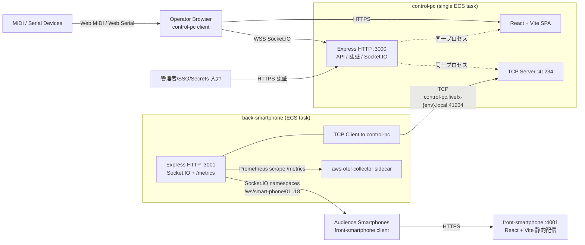
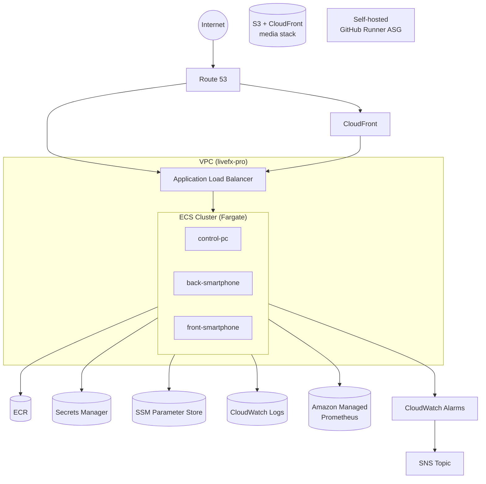
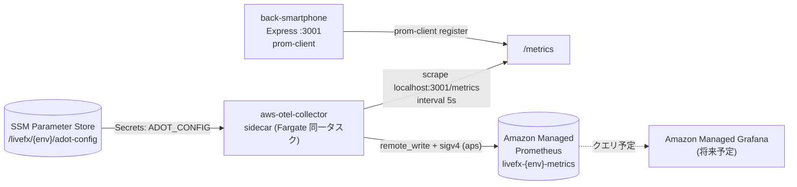
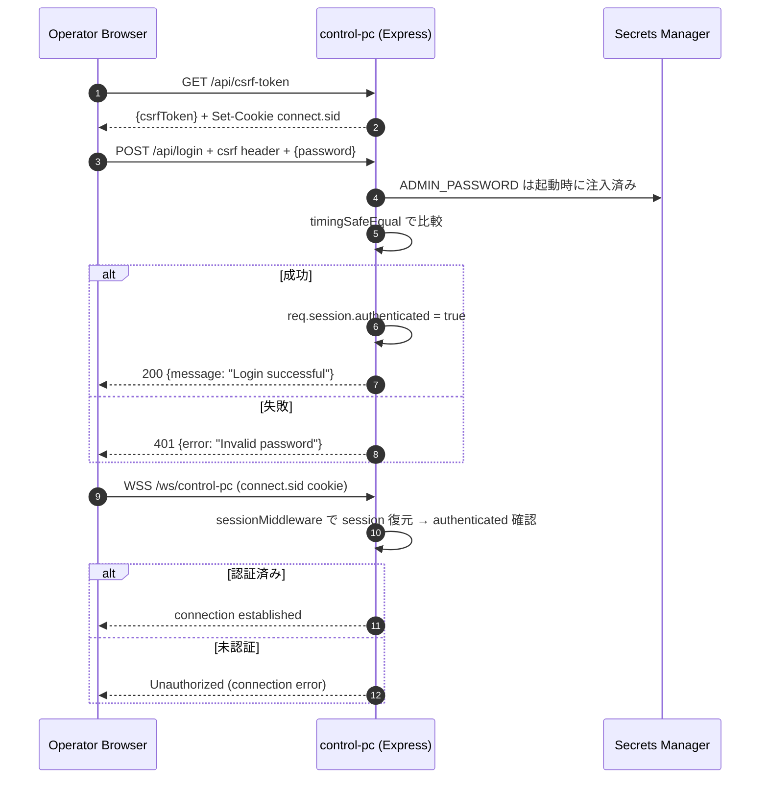

# WebSocket 同時接続 3000 超のライブ演出システムを 2026 年も披露しました

## アジェンダ

| no  | タイトル                                                                | 説明                                     |
| --- | ----------------------------------------------------------------------- | ---------------------------------------- |
| 1   | [はじめに](#1-はじめに)                                                 | 大成功の裏側                             |
| 2   | [去年からの進化](#2-去年からの進化)                                     | 去年からのアップデート                   |
| 3   | [プロジェクトについて](#3-プロジェクトについて)                         | 開発メンバーのアップデートなど           |
| 4   | [システムアーキテクチャ（2026ver）](#4-システムアーキテクチャ2026ver)   | 2026年版アーキテクチャ構成               |
| 5   | [改めてプレゼン構成とシステム紹介](#5-改めてプレゼン構成とシステム紹介) | プレゼン構成とシステムの使い方           |
| 6   | [スケジュール感](#6-スケジュール感)                                     | 開発の経過を解説                         |
| 7   | [失敗・学び](#7-失敗学び)                                               | 本プロジェクトでの失敗とそこから得た学び |
| 8   | [感想](#8-感想)                                                         | プロジェクト中に起きたトラブル           |
| 9   | [今後2027への布石](#9-今後2027への布石)                                 | 商用化を含めた今後の展望                 |

## 1. はじめに

結論から言うと、今回も大成功しました。

改めて、LiveFx は、ライブパフォーマンスにおける演者と観客間のインタラクションを促進するために開発されたデジタル演出ツールです。
本システムの主要な特徴は、演者側の MIDI コントローラーによる画面演出の操作を、リアルタイムに観客のスマートフォンへ視覚効果として同期表示させる点にあります。

滋慶学園グループの入学式プレゼンでの利用を目的として開発されました。
また、保護者を含めた 18 の専門学校グループ、最大 5,000 台の観客用スマートフォンへの同時配信を想定したスケーラブルな設計が求められました。

本稿では、この学生主体となった貴重な開発経験を振り返り、その経緯や所感を共有することを目的とします。
また、記録してきた写真やソースコードの一部を、公開可能な範囲で提示します。
近いうちに、ソースコードを OSS として公開できるようにしたいと思っています。


## 2. 去年からの進化

去年のzenn記事に関してはこちらにあります。

[https://zenn.dev/siw/articles/2e73439f678488](https://zenn.dev/siw/articles/2e73439f678488)

今回の記事では「今年は何が違うのか」に注目してまとめました。

### 環境整備

- Gitlab → Github 移行
- EKS（Elastic Kubernetes Service）→ ECS（Elastic Container Service）移行（80 ％コスト削減）
- タグ駆動ブランチングによって dev, sta, pro 環境へのデプロイ
- Artillery を使用した WebSocket 接続テストと、HTTP エンドポイントへの負荷テスト導入
- githook を使った Biome フォーマットを強制
- Dependabot 追加と CI 通過で PR の自動マージと自動クローズ
- Discord bot による議事録作成

### リファクタ

- コントロールのサーバー統合（ `front-control-pc` と `back-control-pc` を `control-pc` へ統合）
- コントロールパネルの大幅刷新
- 全体的な重複コードやバグ修正

### 新機能

- NTP (Network Time Protocol) を利用して、端末間の時刻ずれを吸収
- インタラクティブな演出を追加（クライアントから桜を咲かせる演出）
- SNS 投稿機能（会場の様子を SNS に共有）

### ドキュメント

- Notion のタスクを追加（コーディング以外の TODO を Github Issue と使い分け運用）

### LiveFx-Site

- 一般向けに案内サイトを追加（[https://livefx.siw.ac.jp/](https://livefx.siw.ac.jp/)）

### AI

- Github Copilot を使った PR レビュー
- 個人では Cursor や Claude Code などで開発

## 3. プロジェクトについて

今回も同じくアジャイル開発を採用しました。

### 開発期間

113 日（約 4 ヶ月）

### 開発メンバーの変化

| 期生                | 年制      | 人数         |
| ------------------- | --------- | ------------ |
| プロジェクト 1 期生 | 新 4 年生 | 8 人 → 5 人  |
| プロジェクト 2 期生 | 新 4 年生 | 0 人 → 3 人  |
| プロジェクト 2 期生 | 新 3 年生 | 0 人 → 4 人  |
|                     |           |              |
| 合計                |           | 8 人 → 12 人 |

- プレゼンターには新しく情報科から 2 人参加

### 役割（Discord のタグで管理、重複あり）

| 役割             | 人数            |
| ---------------- | --------------- |
| PM　             | 2人（筆者含む） |
| デザイナー       | 2人             |
| フロントエンド　 | 7人（筆者含む） |
| バックエンド     | 4人             |
| インフラ         | 3人             |

### 定例会議やコミュニケーションツール

| 会議名   | 頻度 | 内容                   |
| -------- | ---- | ---------------------- |
| 定例会議 | 週一 | 開発に関する会議       |
| 演出会議 | 適宜 | 台本や演出に関する会議 |

| ツール名             | 用途                                                   |
| -------------------- | ------------------------------------------------------ |
| GitHub               | レポジトリ/タスク管理                                  |
| Notion               | コーディング以外のタスクや議事録などのドキュメント全て |
| Figma                | 画面設計のデザインやプロトタイプ作成                   |
| FigJam               | スクライビング用                                       |
| Discord              | コミュニケーション全般                                 |
| Microsoft Teams      | 教務とのやりとりに使用                                 |
| Microsoft Sharepoint | 重要なドキュメントを共有するため                       |

## 4. システムアーキテクチャ（2026ver）

### システム構成図


```mermaid
flowchart LR
    Hardware[MIDI / Serial Devices]
    Operator[Operator Browser<br/>control-pc client]
    Admin[管理者/SSO/Secrets 入力]
    Smartphones[Audience Smartphones<br/>front-smartphone client]

    subgraph ControlPC["control-pc (single ECS task)"]
        ControlClient[React + Vite SPA]
        ControlHttp[Express HTTP :3000<br/>API / 認証 / Socket.IO]
        ControlTcp[TCP Server :41234]
    end

    subgraph BackSP["back-smartphone (ECS task)"]
        BackHttp[Express HTTP :3001<br/>Socket.IO + /metrics]
        BackTcp[TCP Client to control-pc]
        ADOT[aws-otel-collector sidecar]
    end

    FrontSP[front-smartphone :4001<br/>React + Vite 静的配信]

    Hardware -->|Web MIDI / Web Serial| Operator
    Operator -->|HTTPS| ControlClient
    Operator -->|WSS Socket.IO| ControlHttp
    Admin -->|HTTPS 認証| ControlHttp

    ControlHttp -.->|"同一プロセス"| ControlTcp
    ControlHttp -.->|"同一プロセス"| ControlClient

    BackTcp -->|"TCP<br/>control-pc.livefx-{env}.local:41234"| ControlTcp
    BackHttp --- BackTcp
    BackHttp -->|"Prometheus scrape /metrics"| ADOT

    BackHttp -->|"Socket.IO namespaces<br/>/ws/smart-phone/01..18"| Smartphones
    Smartphones -->|HTTPS| FrontSP
```

### AWS 構成図


```mermaid
flowchart TB
    Internet((Internet))
    R53[Route 53]
    CF[CloudFront]

    subgraph VPC["VPC (livefx-pro)"]
        ALB[Application Load Balancer]
        subgraph ECS["ECS Cluster (Fargate)"]
            ControlPC[control-pc]
            BackSP[back-smartphone]
            FrontSP[front-smartphone]
        end
    end

    ECR[("ECR")]
    SM[("Secrets Manager")]
    SSM[("SSM Parameter Store")]
    Logs[("CloudWatch Logs")]
    AMP[("Amazon Managed<br/>Prometheus")]
    Alarms[CloudWatch Alarms]
    SNS[SNS Topic]
    Media[("S3 + CloudFront<br/>media stack")]
    Runner[Self-hosted<br/>GitHub Runner ASG]

    Internet --> R53
    R53 --> CF
    R53 --> ALB
    CF --> ALB
    ALB --> ECS

    ECS --> ECR
    ECS --> SM
    ECS --> SSM
    ECS --> Logs
    ECS --> AMP
    ECS --> Alarms
    Alarms --> SNS
```

### サーバーごとの機能

3 アプリの大まかな立ち位置は、`control-pc` が「演出の司令塔」、`back-smartphone` が「スマホ向け配信ハブ」、`front-smartphone` が「観客の描画端末」です。
どれも Node.js / React / TypeScript を使っていますが、責務とプロトコルが明確に分かれています。

#### `front-smartphone`

観客スマホの React アプリ (`front-smartphone`) は、1 つの URL 上で 6 つの画面を切り替えるシングルページ構成です。
オペレーターが `control-pc` から `changePage` イベントを投げると、`back-smartphone` の Socket.IO 経由で `changePage` が届き、`setCurrentPage(page)` で差し替わります。

##### 画面一覧

| 画面                 | MIDI ボタン番号 | 表示タイミング                  | 役割 / 中身                                                                                                                                          | 去年からの変化 |
| -------------------- | --------------- | ------------------------------- | ---------------------------------------------------------------------------------------------------------------------------------------------------- | -------------- |
| ロゴ画面             | 112             | 初回アクセス直後                | 黒背景に `LiveFx` ロゴをフェードインで表示。                                                                                                         |                |
| 待機画面             | 113             | 開式前の案内時間から演出前まで  | グループ番号 (01-18) に紐付く学校名を表示しつつ、花びらが降る演出。入学おめでとうメッセージ付き                                                      |                |
| 演出画面             | 114             | 本番の演出                      | 画面自体は `null` を返し、`document.body` の背景色と `<div>` フィルターだけで演出する。                                                              |                |
| インタラクティブ画面 | 115             | 観客参加型コンテンツ (桜の選択) | 4 の花から 1 つを選び、上スワイプで確定して `POST /api/cherry-blossom/select` に送る。送信後は「スクリーンをご覧ください！」のロック画面に切り替わる | 完全新規追加   |
| エピローグ画面       | 116             | 演出終了後                      | 開発者を流すエンドロール動画を自動で再生。開発時はローカル MP4、本番は CloudFront 配信                                                               | 動画再生に変更 |
| ポータル画面         | 117             | プレゼン終了後                  | イラスト背景に雲のフロートアニメーションを重ね、LiveFx-Site への導線を作る画面                                                                       | 完全新規追加   |

> インタラクティブ画面


#### `control-pc`

サーバー側は受け取ったイベントで `currentPage` / `currentPattern` / `currentFilter` / `currentGroups` を記憶し、同じ内容を TCP で `back-smartphone` へフォワードする

| 状態                   | 更新契機                                                        | 用途                                                      |
| ---------------------- | --------------------------------------------------------------- | --------------------------------------------------------- |
| `currentPage`          | `changePage` イベント受信時                                     | 次の接続/再接続クライアントに送る画面情報                 |
| `currentPattern`       | `pattern` / `sendAdjustmentData` / `sendFlexPatternData` 受信時 | 再接続時に演出を復元するためのペイロード (文字列 or JSON) |
| `currentRunUNIXTimeMs` | パターン系イベント受信時                                        | 演出実行の時間基準 (再接続時の相対時刻計算に使う)         |
| `currentFilter`        | `changeFilter` 受信時                                           | フィルターの不透明度 (0-100)                              |
| `currentGroups`        | 演出イベントの `groups` を直接反映                              | 対象グループの一覧 (1-based)                              |

> 抜本的に修正した Control-Panel v2


### 3 アプリの責務マトリクス

| 項目               | control-pc                         | back-smartphone                 | front-smartphone                |
| ------------------ | ---------------------------------- | ------------------------------- | ------------------------------- |
| エントリーポイント | `control-pc/src/server/main.ts`    | `back-smartphone/src/app.ts`    | `front-smartphone/src/main.tsx` |
| 公開ポート         | HTTP 3000 + TCP 41234              | HTTP 3001                       | HTTP 4001 (静的)                |
| Socket.IO 役割     | サーバー (`/ws/control-pc`)        | サーバー (`/ws/smart-phone/NN`) | クライアント                    |
| TCP 役割           | サーバー                           | クライアント                    | なし                            |
| 状態保持           | プロセス内変数 (`currentPage` 他)  | プロセス内変数 + Redis Pub/Sub  | なし (受信即描画)               |
| 認証               | セッション + CSRF                  | なし (CORS allow list)          | なし                            |
| 外部ハードウェア   | ブラウザから Web MIDI / Web Serial | なし                            | なし                            |
| 監視               | `/api/status`                      | `/metrics` (Prometheus)         | ALB アクセスログ中心            |

### メトリクス収集


```mermaid
flowchart LR
    App["back-smartphone<br/>Express :3001<br/>prom-client"]
    Endpoint["/metrics"]
    ADOT["aws-otel-collector<br/>sidecar (Fargate 同一タスク)"]
    SSM[("SSM Parameter Store<br/>/livefx/{env}/adot-config")]
    AMP[("Amazon Managed<br/>Prometheus<br/>livefx-{env}-metrics")]
    Grafana["Amazon Managed Grafana<br/>(将来予定)"]

    App -- "prom-client register" --> Endpoint
    ADOT -- "scrape localhost:3001/metrics<br/>interval 5s" --> Endpoint
    SSM -- "Secrets: ADOT_CONFIG" --> ADOT
    ADOT -- "remote_write + sigv4 (aps)" --> AMP
    AMP -. クエリ予定 .-> Grafana
```

## 5. 改めてプレゼン構成とシステム紹介

さいたまIT・WEB専門学校のプレゼン構成はざっくり下の通りです。

### イントロ（全体ざっくり）

- 新入生へのお祝い＆自己紹介（エンジニア志望・Web デザイナー志望）
- IT は身近で、生活や様々な分野で活用されていることを説明
- 学校では技術＋コミュニケーション力を学び、IT 人材を育成していると紹介
- 学習成果として「 LiveFx 」を体験してもらう流れへ

### LiveFx パート

- 席ごとに配置された QR コードを読み込んでスマホ準備
- スマホを使って会場演出（単色・ウェーブなど）を体験
- PC から制御されている仕組みを紹介
- インタラクティブ機能で「想い」を花として表現（参加型演出）

### 締め

- LiveFx は今後の発表（美容分野）でも使用
- IT は無限の可能性があり、原動力は一人ひとりの想い
- 学校生活を通して未来を一緒に作ろうと呼びかけ
- 改めて入学おめでとうで締め

また、美容分野でもモデルの動きに合わせた演出が使われました。

## 6. スケジュール感

### 初顔合わせ（2025/12/17）

対面による顔合わせです。
最初に、去年メンバー向けに今年の開発方針（目標）が決まりました


さらに、大まかなマイルストーンや役割整理をしました。


去年のメンバーをメインに、去年やり残したことと、今年やりたいことをまとめました。
下はそれの要約です

```md
## 今年の追加事項

- **画面/導線**
  - トップにプロジェクト一覧（公開/限定/非公開）
  - 概要・体験方法・環境を明示
  - 認証フローと管理画面（ユーザー/プロジェクト/環境）

- **認証/権限**
  - Cognito検討＋将来移行できる設計
  - Passkey対応検討
  - RBAC（管理者/制作者/一般）

- **リアルタイム/セキュリティ**
  - WebSocketの再接続・モバイル耐性
  - XSS対策、データ検証、トークン管理

- **時刻同期**
  - NTP or WebSocketベースで高精度同期
  - RTT補正・誤差測定
  - 超音波なども含めて検討

- **環境/運用**
  - dev/sta/prod分離
  - staは自動削除でコスト最適化
  - CI/CD＋Discord通知

- **Analytics/監視**
  - 行動ログ・画面遷移取得
  - 接続状況・同期誤差・エラー監視

- **演出/インタラクション**
  - ジェスチャー・マルチタッチ活用
  - 音響（超音波等）による制御
  - フィジカル×デジタル演出重視
```

### 荒れ果てた環境の整備期（2025/12/23〜）

最優先でやるべきは環境構築整備でした。
特に以下の項目です。

#### 1. フォーマッターの導入とCIによる強制

もともとフォーマッターを導入していなかったため、ソースコードはかなり自由に書かれていました。
その結果、空行や構文の書き方に不統一が目立ち、コードリーディングに時間がかかる状態になっていました。

私は以前から自分のプロジェクトで husky や lint-staged を使い、コミット前にフォーマットを強制していたため、この対応は比較的スムーズに進めることができました。
また、GitHub Actions を利用して、フォーマットが適用されているかのチェックも行うようにしました。

devcontainer の導入も検討しましたが、今回は採用していません。

理由はいくつかありますが、最も大きいのはエディタ依存の問題です。
devcontainer 自体は仕様としてはエディタ非依存ですが、実際の運用では VSCode の拡張機能に強く依存する形になります。

そのため、Cursor など他のエディタを利用しているメンバーとの間で開発体験に差が生まれる可能性がありました。

また、今回のケースではフォーマッターと CI によるチェックを導入することで、環境差異の問題の大部分は解消できていました。
そのため、Docker ベースの開発環境を新たに整備するコストに対して、得られるメリットは限定的と判断しました。

[https://zenn.dev/risu729/articles/latest-husky-lint-staged](https://zenn.dev/risu729/articles/latest-husky-lint-staged)

#### 2. 通知機能

通知のトリガーとして想定していたのは、「演出が始まるタイミング」です。
このタイミングで通知を行えば、観客にスマホを掲げるよう案内する必要がなくなると考えました。

しかし、最終的にはこの機能は実装しませんでした。
理由はシンプルで、技術的な難易度が高かったためです。

当初はPWAの導入や、いっそのことネイティブアプリ化する案も検討しましたが、
今回のスコープでは必須ではないこと、そして開発コストが非常に大きいことから見送りとしました。

#### 3. コントロールPCの認証機能

実は昨年まで、コントロール PC には認証機能が存在していませんでした。
URL を知っていれば、誰でもアクセスできる状態だったのです。

つまり、理論上は誰でも会場の演出画面を操作できる状態でした。
冷静に考えると、かなり危険な状態です。

ではなぜ実装していなかったのかというと、
「当日にその URL を知る人はいないだろう」という、楽観的な想定に頼っていたためです。

実際の運用では、QR コード入りの封筒を開封するという導線があり、
そこからコントロール PC が指示を送るまでの時間は約 10 秒程度でした。
この短時間で URL を特定するのは現実的ではない、という判断でした。

結果的に問題は発生しませんでしたが、運が良かっただけとも言えます。

今年は時間的な余裕もあるため、この認証機能を正式に実装しました。


```mermaid
sequenceDiagram
    autonumber
    participant Browser as Operator Browser
    participant CPC as control-pc (Express)
    participant SM as Secrets Manager
    Browser->>CPC: GET /api/csrf-token
    CPC-->>Browser: {csrfToken} + Set-Cookie connect.sid
    Browser->>CPC: POST /api/login + csrf header + {password}
    CPC->>SM: ADMIN_PASSWORD は起動時に注入済み
    CPC->>CPC: timingSafeEqual で比較
    alt 成功
        CPC->>CPC: req.session.authenticated = true
        CPC-->>Browser: 200 {message: "Login successful"}
    else 失敗
        CPC-->>Browser: 401 {error: "Invalid password"}
    end
    Browser->>CPC: WSS /ws/control-pc (connect.sid cookie)
    CPC->>CPC: sessionMiddleware で session 復元 → authenticated 確認
    alt 認証済み
        CPC-->>Browser: connection established
    else 未認証
        CPC-->>Browser: Unauthorized (connection error)
    end
```

#### 4. `front-control-pc` と `back-control-pc` を `control-pc` へ統合

この話が出た背景として、もともと本プロジェクトではサーバー数が 4 つあり、構成としてやや複雑でした。

特に control-pc に関してはフロントエンドとバックエンドを分離していましたが、
WebSocket の接続は 1 系統のみであり、分離する必要性は低い状態でした。

一方で、UI と API の両方は必要なため、フロントエンドとバックエンドを一体で扱えるフルスタック構成が求められました。

そこで今回は、既存で利用していた vite と express を活かしつつ、vite-express を採用して統合しました。

[https://github.com/szymmis/vite-express](https://github.com/szymmis/vite-express)

### 新メンバーの構成理解期（2026/01/06〜）

新メンバーに向けて、ワーキングアグリーメントや、Discord でのチャンネルごとのの使い方、ブランチ運用規則などを `CONTRIBUTING` にまとめて説明しました。

```md
- PR出した人が指定
- レビュワーは関係しそうな人全員指定する
- 2人以上（今年からの人と去年からやってる人）から承認を得たらマージ
- バイパスユーザ（設定する人： ） done
  - PM（）
  - @
  - ...
```

もちろん、プロジェクトのサーバー構成や細かな技術スタックの説明をしました。
まずは自分たちで理解を落とし込んでもらうようにしました。

```md
- [x] 現状のメンバーそれぞれの理解度
      1/27(火)くらいまでに
  - フロント
    - ReactRouter
    - TailwindCSS
    - Reactの基本的文法（`app.tsx`からコンポーネントを追う）
  - バック
    - Typescript(コードを読めるくらいには)
    - socket.io
      →ある程度何をしてるかわかるくらいには読んで
  - インフラ
    - どこが何をやってるか理解しといて

- [x] タスク振り（今週決まらなかったらテスト週入るから再来週になるかも） もう少し絞る
- [ ] サービス紹介ページは別でgithub pagesなんかでもいいかも、リファクタとか、比較的簡単なタスクを割り当てると思う。
  - 2年のGit練習とかReact学習に
- [x] Copilot の使い方
  - [x] Enterpriseについてとorganization について現状の管理の仕方が違う気がする
  - [ ] レビューで使えそうか
  - [ ] メンバーがcopilot を使えるようになっているか
  - [ ] 何ができるのかを調べて　`Github Campas Program`
- [x] Notionで議事録録るためのプランが欲しい
```

ただ、新メンバーにとっては想定以上に難易度が高く、自力で理解を落とし込むには時間がかかりそうでした。
そこで、フロント・バック・インフラごとに「コードを読む会」を実施しました。

しかし、個人的にはあまり有意義なものにはできなかったと感じています。

もともとは、以下のような進め方を想定していました。

1. 最初の30分は黙読（各自で理解を深める）
2. その後、理解のすり合わせ（間違っていても問題なし）

この形式にしたのは、自分でコードを読むことでしか得られない理解があると考えていたためです。
また、間違いはむしろ重要で、どこで認識がズレたのかを知ること自体に価値があると思っていました。
加えて、「自分でコードを読み解く」という姿勢を持つための、一種の試練という意図もありました。

しかし実際には、最初の黙読の段階から理解が難しい状態でした。
そのため、途中から一方的に解説する形式へと変わっていきました。

とはいえ、その状況で「質問はありますか」と促しても、そもそも「どこがわからないのかがわからない」状態では、質問自体が難しいものです。

結果として、場の雰囲気もやや重くなってしまいました。

その後、徐々にタスクの洗い出しが進み、開発作業が本格的に始まりました。
また、2/14のリハーサルに向けた演出会議も行われました。

### 第一回リハーサル（2026/02/14）

東京スポーツ・レクリエーション専門学校（TSR）で第一回目のリハーサルが行われました。
原稿に関しては、修正する時間が無かったため、ほとんど去年と同じ形で発表をしました。

```md
学校としての演出、紹介が弱い
学校で学んだこと、開発の過程など
どんな過程でこれができるようになるかが見えるように
学科だけを聞いても何ができるかが想像がつきにくいので、どんな人間になる！があってもいいかも
将来はこういう職種になります！みたいな
社会的な意義がITにはあるのに、使ってる側はあんまり感じていない

→ 日常のITの事例を2個くらい紹介

例えば改札
改札をスマホで通るとこができる
当たり前のようだが、その裏側を作っている人がいる

いつかスマホもいらなくなるかもしれない

学校のテーマは？

例

- 医療→上級生との繋がり
- 美容→挑戦

## 先生方からのFB

学校のキーワード　「チーム開発とハイフレックス」

色々なことを学ぶ、コンピュータを用いたものをある程度作れるようになれる。
ITを学んで何ができるようになるかが入学する人たちが知れたら。

## 案

- ChatGPTは誰でも知ってる
  - 「みなさんも知っているChatGPTも〜」
  - 「みなさん、chatGPTは知ってますよね？」みたいな問いかけの方が良き！何かしらのリアクションを求めるような、飽きさせない工夫
- 技術の紹介は使っているサービスをもとに紹介
  - サービスをリストアップする人
  - 何の技術が使われているかをリサーチする人

  ↑　PM主体にタスクを割り振り
```

この段階で、タスクは自分から撮りに行く姿勢を取っていました。
気になる Issue があったら「これやっていいですか？」を Discord に投げる感じです。
ただ、チームメンバーが割と謙虚なのもあって、あまり発言は多くなかったです。
リハーサルで再度下のアナウンスをしました。

```md
# このプロジェクトの敷居を下げましょう！気軽にリアクション、コメントしてください！敬語をつかわなきゃとか、間違ったらどうしようとか、気にしないで良いです！
```

### 思い出しながら少しづつ始動（2026/02/17〜）

タスクがより具体的になってきました。

```md
- エピローグ画面を更新する @2年生フロントだれか
  - 更新して、役職なしで全員の名前だけ載せる
  - 一旦notionで整理
  - HPに名前を載せる？（全体デザイン：）

  - クレジット画面をもっと積極的に見て貰えるようにできたらより良い

- LiveFx-siteのfigmaデザイン

  サイト内の項目・内容の洗い出し（@今年からの人）
  → 分からないとこは都度去年からの人に聞く（ついでにLiveFX全体理解を。。。）

- LiveFxのロゴの解像度低い問題
  ロゴ画像SVGに変更する（@）
- 各プロジェクトのリファクタ

- 新規機能の検討

- 画像・映像のアップロード機能（SNS及び共同アルバム）
  - Webカメラ(動画？画像の連続撮影？)
  - S3
  - SNSへのシェア
  - 完全に裏で動作
  - プレビューと
  - 手を振り終わったら

- UI及びフローの検討
  →使い方のガイダンスがなくても使用ができてかつヘルプ画面を用意しておく

- 待機画面と一緒にやる。追加する機能が決まったら、生きてたらやる(@)

- NTPサーバーの実装

最初の接続時に内部時間とのズレを把握するだけでも実装可能かもしれない
ずれてる原因調査（）
```

### 演出スライドの抜本的見直し（2026/02/18〜）

去年は先生方にスライドや音楽を含めた全体のプレゼン構成を考えてもらいました。
しかし、今回は時間もあり、よりメッセージ性のあるものを学生主体で作成し直しました。


### インタラクティブ機能の考察（2026/03/04〜）

ここからは、メインのインタラクティブ機能について話が進みました。

インタラクティブ（interactive）とは、「双方向」「相互作用」「対話式」を意味する言葉で、情報の一方的な配信ではなく、送り手と受け手がその場で反応をやり取りできる状態です。
今回でいえば、新入生含めた観客の皆さんのアクションがこちらに伝わって、わかりやすい形で反応が返ってくる、ビジュアライズできるような機能です。

まずは、どんな操作をさせるかをメインにアイデアを発散させました。

```md
### スマホをゆっくりと動かさせる演出（15秒程度）

- メトロノームを映して全体のスマホの動きがあってくるとeffectがかかる
- **たくさんボタンを押す**
  - **10秒くらいならできるかも**
- スマホの角度で色を変化させる
  - ボールを描画、そのボールを移動させて色を調整→ちょっと長い？
- 出演者がアクションを起こすと、光が連動する
  - 指さしたり、手を振ったり
  - 参考：デザインあ展
    - https://youtube.com/shorts/POpch0H2U3o?si=JU0sRF5V8cUgzyIf
  - 振る動きは同じですが、たまたま流れてきたので貼っておきます
    - https://x.com/sanadorabel/status/2029088259306078620?s=20

  - 演出について
  - パターン
    - 文字の表示
      - https://youtu.be/lLUN9AJamlI?si=cE8kW_JwaECKkxF4
      - https://youtu.be/CTi5bdKiwAQ?si=oQNt00FFvns-XIqu
    - 演者の動きに合わせて
    - 参考：嵐のLive映像がYouTubeで公開されている
      - https://youtu.be/J0F0e8jd5xk?si=WQ5rlr0qBgS4Q4_H&t=3741
    - 参考：イルミネーションも（光×音）

  - 最初静か→後半にもりあがるように（曲も含め）
    - 盛り上がったけどそこが頂点ではない！みたいなのができると良い
  - 開いている人数に合わせて何かを変化させる
    - YouTubeの視聴者数の人数の表示みたいなものとか？

- ペンライトとの差別化
  - スマホならではの演出が欲しい！！

使えそうなセンサー類
https://developer.mozilla.org/ja/docs/Web/API/Sensor_APIs
```

アンケートによる決選投票で、一旦は以下の通りに決まりました。
しかし後述しますが、トラブルがあって最終的には別のものになりました。

```md
1. たくさんボタンを押す
   - 10秒くらいならできるかも
2. **出演者がアクションを起こすと、光が連動する**：こっちに決まり🌸
   - 指さしたり、手を振ったり、角度を検出とか
   - 同じ動きを何％がしたらとか（学校ごと）
   - 早く振らせないための工夫は必要
     - メトロノームを表示するなど
   - 検証 (担当：@ 中心に
     - 各速度をとってみる
     - どのくらいのレート？
```

それに伴い、フォーマット、リファクタリングも次第に完了し、環境整備が完了しました。
具体的なタスクを新メンバーに割り当てられるようになりました。

#### SNS 共有機能

```md
### 美容

- 外カメラ（SNS共有）
- ハッシュタグをつけて投稿までをやる
- デモ → https://kuwaharu-git.github.io/web-camera-sns/

### LiveFx

- ユーザに許可をしてもらい、ランダムでインカメで撮る？
- 写真の場合ブレるので動画も検討→保存はできる、SNS共有は分からない
- 撮った動画が使えるかどうかの検証が必要→今日の夜とか
  - 夜の街灯近くで撮ってみる
- 台本に追加
  - 「共有してください！」とか
  - 「掲げてください」とかで、ブレなどの懸念が抑えられるかも？
- 開発側の人間が何人か仕込んで撮る

### 共通

- 懸念：トラフィックが増える
  - ランダムで撮るなら大丈夫そう
- ランダムで撮影し、S3にあげていく
- 共通のアルバム機能
- 「SNSに投稿しますか？」
```

この時期から定例会が長すぎるので、なるべく短くやりたいという話が出ていました。

```md
定例会を作業報告会にしないで、疑問点とか話さなきゃいけないことだけ話す会にしたいと思ってます。
作業報告はDiscordとGithubで非同期的に連絡すべきかと。定例会が退屈に感じてしまうと嫌なので。
```

一部音楽は去年のものを流用しますが、LiveFx 演出中に流す音楽について話し合いが始まりました。
今回は試しに [Suno](https://suno.com/) という音楽生成のAIを使いました。
また、スマホをタイミングよく振るために、BPM 100程度で作成してもらいました。

さらに、さいたま IT・WEB 専門学校のプレゼンで読む原稿に関しても段々と完成してきました。

### 議事録を正確に書き残せない問題（2026/03/05〜2026/03/22）

Notionで取っていた議事録を、開発メンバーで見返す機会がありました。
そこで気づいたのが、「内容に誤りが含まれていた」ということです。

もともと議事録の作成は任意としており、担当者は毎回 1〜2 人程度でした。
その状況で「毎回書くのが間に合わない」という意見が出るのは当然であり、これに対処するためにいくつかの改善案を検討しました。

まず前提として、話す人と書く人は分ける必要があります。
さらに、書く人には一定の理解力も求められます。
しかし、限られたリソースの中でそれを満たすのは容易ではありませんでした。

ここで改めて整理したゴールは、「議事録を正確な履歴として残すこと」です。
このゴールを達成するために、以下のような観点で検討を進めました。

```md
1. **会議設計の改善をどう実践するか**
   - スクライバーの決め方（立候補？ PM 指名？）
   - 休憩のタイミング
   - スクライビングのツール（FigJam とか）
2. **メンバーから意見を集める方法**
   - 全員から集めるか、一部でいいか
   - ツールを Discord スレッドにするか FigJam にするか
   - 意見を PM が精査して議題に上げる仕組みにするか
3. **時間配分と開発の時間確保**
   - 今回の会議で開発の話の時間が足りるか
   - PM に事前に時間配分を決めてもらうか
```

特に重要だと感じたのは、議事録の精度を担保する役割です。
必要であれば会議を一時停止してでも、「正しく記録されているか」を確認するプロセスが不可欠でした。

また、会議運営そのものも見直しました。
事前にレジュメを用意し、議題ごとに時間とゴールを設定する。
議論が発散しそうな場合は別議題として切り出し、その場で扱うか後回しにするかを判断するようにしました。
一方で、グラフィックレコーディングという手法も検討しましたが、リアルタイムでの正確性確認が難しいという理由から見送りました。

続く会議では FigJam を用いたスクライビングも試しました。
会議の流れを視覚的に追いやすいというメリットはあったものの、情報が分散してしまう点が課題となり、最終的には Notion に戻す判断となりました。

```md
スクライビングはfigjamでやる必要はないと仮定してnotionで戻す。
大事なのはファシリテーター。まとめるなら結局ここが大事。
```

### インタラクティブ演出のトラブルと葛藤（2026/03/17）

事前に実施していたインタラクティブ演出の操作方法に関する投票について、メンバー間で前提が揃っていなかったことに気づきました。
当初のアンケートは「操作していて気持ちが良いか」を基準に設計していましたが、実際に求められていたのは「ストーリー性のある体験」でした。

> インタラクティブ演出の操作方法どれがいい？

|                            |     |     |
| -------------------------- | --- | --- |
| タップ（連打や長押しなど） | 6票 | 35% |
| 息ふきかける               | 7票 | 41% |
| スワイプ                   | 4票 | 24% |
| その他（教えてね）         | 0票 | 0%  |

この結果だけを見ると「息を吹きかける」方法が最も支持されていました。
実際、デモ時のリアクションも最も良く、「操作していて気持ちが良い」という観点では優れていました。

しかし、「最終的に桜を咲かせる」という演出全体で考えたときに、この操作にはストーリー性が欠けていることが明らかになりました。
「スマホに息を吹きかけると桜が咲く」という体験は、直感的な面白さはあるものの、文脈としてはやや唐突で、違和感が残るものでした。

方向性がブレることにはリスクもありますが、この段階であればまだやり直せると判断し、一度白紙に戻して再検討することにしました。

```md
インタラクションは一旦練り直し。
息吹きかけ❌
タップかスワイプの決選投票
```

その後、演出会議でFigmaを用いて議論を重ね、最終的な体験設計は以下のように整理されました。

```md
花びらが手元のスマホに
↓
スワイプで送る
↓
スクリーンの桜が増える
↓
臨界点
↓
一気に満開
```

```md
操作方法はスワイプで、入学したらやりたいことを選択させて、これからの希望が桜として開花するストーリーに
```

### 会議設計の見直しから（2026/03/17〜）

前述した議事録問題から、会議設計の見直しが行われました。

```md
議事録今の問題点は話をまとめる工程と記述する工程を同じ人が行なっているため、
まとめるという工程をファシリテータに任せることで議事録は追いつくんじゃないか
```

さらに、Notion タスクの精査を定例前に行うようにしました。

```md
- **レジメ締切日曜日18時**
- ステータスに「集中会議待ち」を用意しました。
- PMは日曜夜にそのページ内でレジメ精査（やる順番・次回に回す議題・時間配分）
- 精査後、議事録チャンネルに全体通知、アイデア出す議題があれば定例までに案をnotionに書いて貰うようアナウンスする。
```

ただ、最終的にはこのルールをメンバーに理解してもらい、運用するまでには時間がかかるため、自然と使われなくなりました。

```md
会議を短くするために議論事項を少なくするのはいいけど、漏れがあるぐらいだったら今まで通りの方がいい
精査というよりは集中して会議したいかどうかが大事
```

### 第三回リハーサル（2026/03/20）

東京医薬看護専門学校第四校舎で第三回目のリハーサルが行われました。
ここでは練り直した原稿や演出を発表しました。
特に、インタラクティブ演出に関しては、「桜が咲く」という要素が運営からウケてもらえて嬉しかったです。

ここでは、細かな原稿の修正を行いました。
ただ、美容の演出中に使う予定だった SNS 共有機能に関しては台本になく、後のミーティングでも話し合った結果、使われないことになりました。
具体的には、以下の２点で使われなくなりました。

1. 「ライトをつけてください」と「動画を撮ってください」は矛盾する。（両方を同時にやる案内が難しい）
2. SNS に投稿したいというのをプロジェクト側に伝えたが、各学校の承諾が必要になる可能性がある。

しかし、機能としては完成していて、OSS として公開する上では追加したいと思っています。

### デザイン作成から実装検証へ（2026/03/20〜）

インタラクティブ演出を中心に、Figmaでのデザイン作成とコーディングやインフラでの懸念点を洗い出しました。

```md
### フロント

動的に桜を咲かせる過程をどうするのか？
3000人分の位置を決めるのは不可能に近い

現実的には100人ごとでグループ分けしてその中でランダムにするのが良いか？

桜の色は複数

混ざっている状態で咲いていく（青色のゾーンとかはない）

### バックエンド

やること

- 集計（websocketじゃなくてREST APIでいい）
- スクリーンに表示

最小だと express で post 作る

実装方法2つ @

- バックスマートフォンで実装をする🌸
  - リスクあり
  - 負荷で落ちる可能性
    - ECSだし大丈夫 @
- 新しくサーバを立てる
  - アクセスしたら、インクリメント
  - スクリーンに
```

それ以外にも、

- コントロール PC の画面設計の抜本的な見直し（MIDI を再現した UI への移行や、UI 上で演出を編集できる機能の追加）
- ポータル画面の追加（プレゼン終了後に表示する、LiveFx-Site への誘導画面）
- エンドロール画面の追加（Git で管理している動画ファイルを S3 にデプロイし、CloudFront 経由で配信する CloudFormation 構成）

など、主要機能を並行して開発していきました。

その後、複数回のオンラインリハーサルを通して、プレゼン台本の最終調整を行いました。

### ついに迎えた本番（2026/04/09）

ついに本番当日です。
…が、開始直前にこんなメッセージが飛び込んできました。

```md
waveが会場で順番通りにならないかも
```

原因は、`waveFlex / rippleFlex` の実行順が `schoolId` ベースで決まっていたことにありました。
`Control PC` で指定した `groups` の並び順が、`smartphone` 側に反映されていなかったのです。
対応として、`groups` の配列順をそのまま各端末に渡し、その順序で実行されるように修正しました。

さらに、モニタリング画面上で学校の並び順を変更できるようにし、学校番号と並び順を対応させた JSON をインポート / エクスポートできる仕組みも追加しました。

結果として——

本番 30 分前に再デプロイすることになりました。
（今年もやってしまった…）
とはいえ、無事に動いたので今では笑い話です。

そして、さいたま IT・WEB 専門学校のプレゼンが始まります。
本当にうまくいくのか。
直前のリハーサルでは初歩的なミスもあり、不安はかなり大きい状態でした。

まず、会場の席に配置された封筒の QR コードをスマホで読み取ってもらいます。
多少の戸惑いはありつつも、その後カウントダウンが開始。
会場はざわつき始め、「何が始まるんだろう」という期待感が伝わってきました。

やがて会場が暗転し、単色演出がスタート。

第一印象は、とにかく綺麗でした。
去年は、各スマホの内部時間がバラバラだったため、単色のはずなのにところどころ色がズレてしまっていました。
しかし今回は、NTP による時刻同期を導入したことで、完全に統一。
この改善だけでも、体感で 10 倍以上のクオリティ差がありました。
会場からも、驚きの声が上がっていました。

続いて、ウェーブ演出へ。
こちらも同様に、ズレることなく美しく同期されており、
単色演出以上にインパクトのある体験になっていたと思います。

そして最後に、今回の目玉であるインタラクティブ演出。
スクリーンには、まだ何も咲いていない桜。
そこに対して、スマホから花びらをスワイプして送るよう案内しました。

…が、ここで想定外の出来事が起きます。

案内中からスワイプする人が多く、説明が終わる頃には、すでにかなり桜が咲いてしまっていました。
とはいえ、事前に懸念していた描画負荷の問題はほぼ解消されており、全体としてはスムーズに演出を進めることができました。

ここまで作り上げてきたシステムが、実際に会場で動き、観客の反応として返ってくる。
もしかすると、この場で一番感動していたのは自分だったかもしれません。


## 7. 失敗・学び

今回は良くも悪くもトラブルが少ないプロジェクトでした。
開発メンバー全体として慎重に進める姿勢があり、安全性は高かったと思います。

一方で、その影響もありPRのマージが滞りがちになり、後続タスクに影響が出る場面もありました。
スピードと安全性のバランスは、最後まで課題として残りました。

### 初動のタスクが重く、新メンバーに入りづらい雰囲気を作ってしまった

今回のプロジェクトは、「前年の構成を整備し直す」ことからスタートしました。
しかしこの作業は、過去のコードにある程度精通していなければ難しい内容でした。

さらに、

- サーバー統合に伴うインフラ再編
- フォーマッターなど、属人化しやすい開発基盤の整備

といった、難易度の高いタスクが初期に集中していました。

その結果、新メンバーはこれらのタスクに関与しづらく、プロジェクトに入り込むきっかけを失ってしまっていました。
加えて、これらのタスクは変更量が多くコンフリクトも発生しやすいため、新規機能の開発は一時的に待たざるを得ない状況になっていました。

#### 改善案

最初から難易度の高い基盤整備に着手するのではなく、あえて新メンバーでも触れる軽量なタスクを用意します。

具体的には、

- UIの微修正
- ログ出力の追加
- 簡単なバグ修正
- ドキュメント整備

など、「プロジェクトに触れる入口」を先に作ります。
その上で、

- 基盤整備は小さく分割する
- ペアやモブで進める

ことで、知識のキャッチアップと並行して進められる状態を作ります。

### 「自分からタスクを取りに行って」 「やりたいのがあったら発言して」は難しいことが多い

本プロジェクトでは、「タスクは自分から取りに行く」方針を取っていました。

しかし実際には、これを実践するのは簡単ではありません。
特に、「指示があれば動ける」タイプのメンバーにとってはハードルが高く、結果としてタスクが自然に消化されることはあまりありませんでした。

一方で、こちらから積極的にタスクを割り振ることもせず、結果的に一部のメンバーだけで開発を進めてしまう場面もありました。
これは、チーム全体として良い状態ではありませんでした。
後半からは、新メンバーを中心に検証などの軽めのタスクを割り振るようにし、徐々に全員が関与できる状態へと改善していきました。

その結果、

- タスクの分散
- PR レビューの活性化
- 開発以外の作業スピード向上

といった効果が見られ、チームの雰囲気も改善されたと感じています。

### デザインチームへの負担が大きかった

デザインチームの人数が限られている一方で、新機能は多く、
デザインタスクが集中してしまっていました。

デザイン領域は知識の属人化が起きやすく、他メンバーが簡単にサポートできる状態ではなかったこともあり、結果として負担が偏る形になってしまいました。

### デザインに時間をかけすぎた

特にインタラクティブ演出とエンドロール動画の制作で顕著でした。

- インタラクティブ演出の確定：3/17
- デザイン完成：3/31
- 本番：その約1週間後

つまり、実装期間は実質 1 週間しかありませんでした。
当然ながら検証の時間も十分に取れず、開発チームとしては大きな不安を抱えたまま進めることになりました。

デザインは非常に重要ですが、それ単体では価値を発揮できません。
実装されて初めて意味を持ちます。
実際には、開発段階で技術的な制約や認識のズレが発生し、想定通りに進まないことの方が多いと感じています。

#### 改善案

デザイン完成を待ってから実装するのではなく、早い段階で“粗い状態”でもいいので共有し、並行して進めます。

- ワイヤーフレーム段階で実装を開始
- 技術的に難しい部分は早めに検証
- 定期的にデザインと実装のすり合わせを行う

また、「デザインの完成」をゴールにせず、「実装できる状態になっているか」を基準に進めます。

### 会議時間が長すぎる問題

この問題は結局最後まで解決しませんでした。
しかし、のちの振り返り会でいいフィードバックがありましたので共有します。

#### 何が起きていたか

- 会議が毎回 3 時間かかる
- 発言者が固定化（ミュートで聞いてるだけで参加しているだけの人が増える）
- レジメの読み上げで終了
- 話が脱線して雑談化

#### 本質

「会議が“何をする場”になのか、明確になっていない」

今回でいえば、「必要な人が、必要な意思決定をする場」であるべきということ。
私は正直、人が多いと安心するので、安心感のために集まる場として機能させてしまっていたとも思います。
ただ、気づきました。

1. 会議の人数 ≠ 会議の価値
人が多いほど安心できる会議は、たいてい誰も責任を持っていない
2. 「全員参加」は設計放棄
全員呼ぶのは親切ではなく、設計をサボっているだけだった
3. 会議の参加者は“結果”として決まる
ここめっちゃ大事👇
何を決めるか決める
誰が決めるか決める
だから参加者が決まる
👉 順番が逆だと崩壊する

■ 原則

会議＝「必要な人が、決めるために集まる場」

共有（進捗・数値）は事前に読むもの

■ 改善

時間を区切る

例：課題Aは30分で強制終了


読み上げ禁止

例：資料は事前にNotionで共有


ゴールを絞る

例：「今日はUI方針だけ決める」


人数を絞る

例：意思決定者＋担当者だけ参加


ファシリを置く

例：「それ今やらないです」と止める人

### ツールはなるべくシンプルに統一すべき

今回特に課題となったのは、Notion と GitHub Issue の使い分けです。

- コーディングタスク → GitHub Issue
- それ以外 → Notion

という運用をしていましたが、「コーディングタスク」の定義は人によって異なり、次第に境界が曖昧になっていきました。

その結果、Notion側にも開発タスクが増え、タスクが分散する状態になりました。
タスクが複数の場所に存在すると、

- 現在の全体像が把握しづらい
- 優先度管理が難しい

といった問題が発生します。
PMとして全体を把握する立場だったため、この点にはかなり苦労しました。

また、Notionはタスクの履歴を時系列で追いづらく、完了通知の挙動にも違和感がありました。

現在も両者は併用されていますが、将来的にはGitHubへ統一したいと考えています。
Projectsやマイルストーンなどの機能により、プロジェクト管理との親和性が高いためです。

### `gh pr merge --squash --admin` 事件


これは完全に自分のやらかしです。

通常、このコマンドを実行することはほとんどありません。
しかし今回は、AIによって実行されてしまいました。
もちろん最終的な責任は自分にあります。

リポジトリにはmainブランチの保護ルールがあり、本来は 2 人以上の承認がなければマージできません。
しかし、admin 権限を持っている場合、この制約をバイパスできます。

今回の PR は、main にマージしないと検証できない内容だったため、その意図が AI に伝わり、`--admin` 付きでマージされてしまったと考えられます。
幸い大きな問題は発生せず、すぐに rebase で対応しました。

この件を受けて、

- AIのAuto-Run Modeを無効化
- Cursor Hooksでコマンド実行を制限

といった対策を行いました。
詳細は以下の記事にまとめています。

[https://zenn.dev/tkszenn/articles/cafc72cd8d1754#cursor-hooks](https://zenn.dev/tkszenn/articles/cafc72cd8d1754#cursor-hooks)

## 8. 感想

やはり、前回同様、非常に貴重な経験をさせてもらいました。
今回は前回ほど短期間ではありませんでしたが、新規メンバーに引き継ぎを見据えた開発援助やマネジメントを考察し、サービスローンチに向けたより広い視野から見るということを学べました。

前回からさらに得た学びを書きたいと思います。

### 技術的な学び

- AI を用いた開発や PR レビューの最適化、高速化
- サーバー統合に伴う、通信フローの再構築とインフラ対応
- NTP によるスマホ内部時間の計算とずれ吸収処理
- Github Actions を用いた CI/CD ワークフローと安全マージ
- dev, sta, pro に分けたタグ駆動でのデプロイワークフロー
- 負荷テストによる本番環境の安定稼働への想定
- Dependabot による依存関係の自動アップデート

### プロジェクトマネジメントの学び

- 心理的安全性や組織効力感の醸成のための会議設計や雰囲気作り
- コミュニケーションツール（Notion, GitHub）の活用によるチーム連携の円滑化。
- 新メンバーへナレッジのスムーズな引き継ぎ

### ビジネス的効果

- 保護者含む 18 校の専門学校生が参加する大規模イベントでのシステム提供成功。
- 観客のスマートフォンを活用したインタラクティブ演出体験の創出。
- OSS化や商業化を目指した、将来的な拡張性を有するプラットフォームの基盤構築。

## 9. 今後（2027への布石）

### プロジェクト本来の目的を忘れずに

個人的になりますが、プロジェクト本来の目的は「ITの可能性を伝える」だと思います。
今回であれば、入学式に参加してくれた新入生に対してです。
ウェーブ演出の時の、新入生の驚きと、可能性に満ちた顔を思い出してください。
IT は人の可能性を無限大に広げる、そしてアイデアを形にする、素晴らしい手段です。

今回で筆者含めた一期生メンバーの多くが引退し、来年以降に引き継いでいきますが、この目的を忘れず、楽しく開発していってもらいたいと思います。

### 次にやりたいこと

最初のミーティングでもあった通り、OSS化、商用化を目指しています。
ぜひ、応援をよろしくお願いします。


